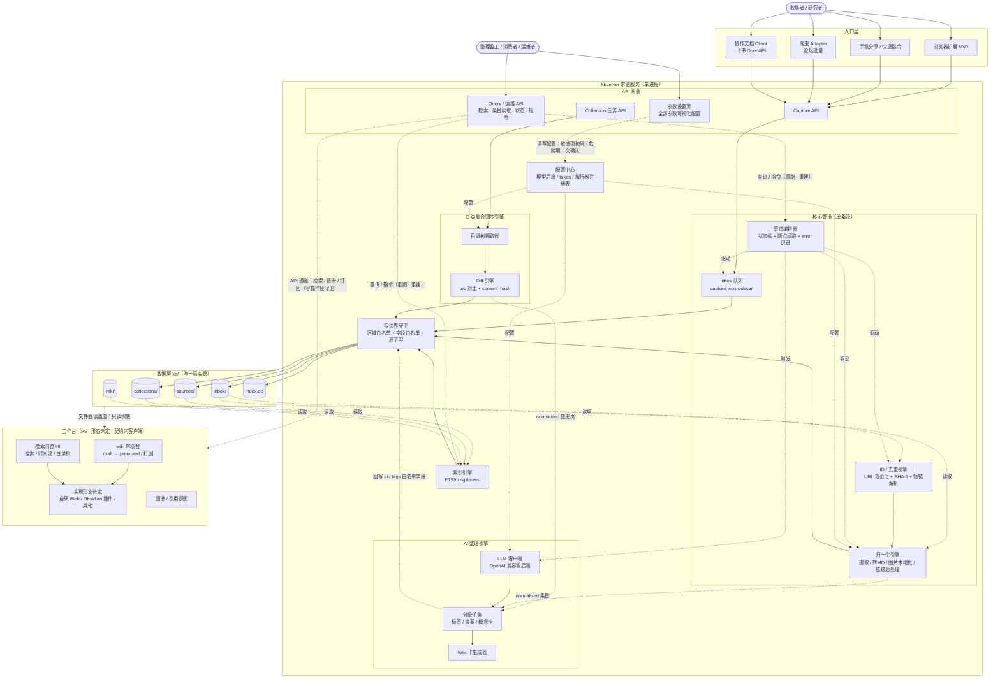
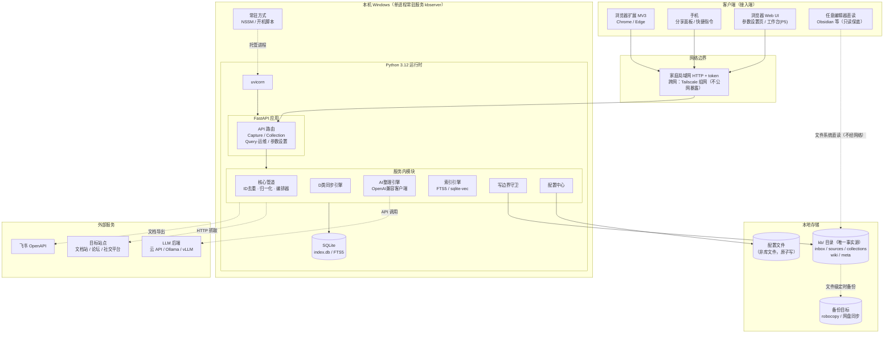
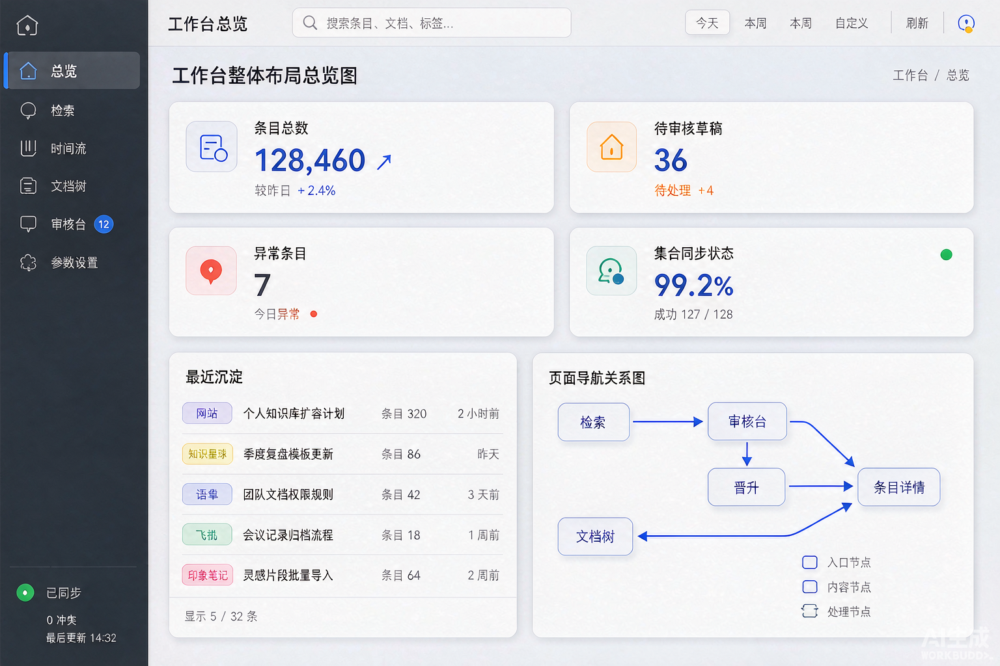
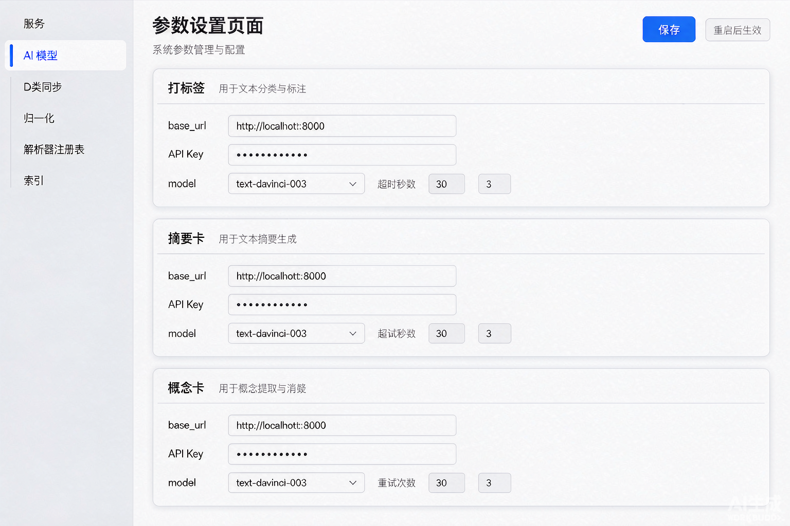
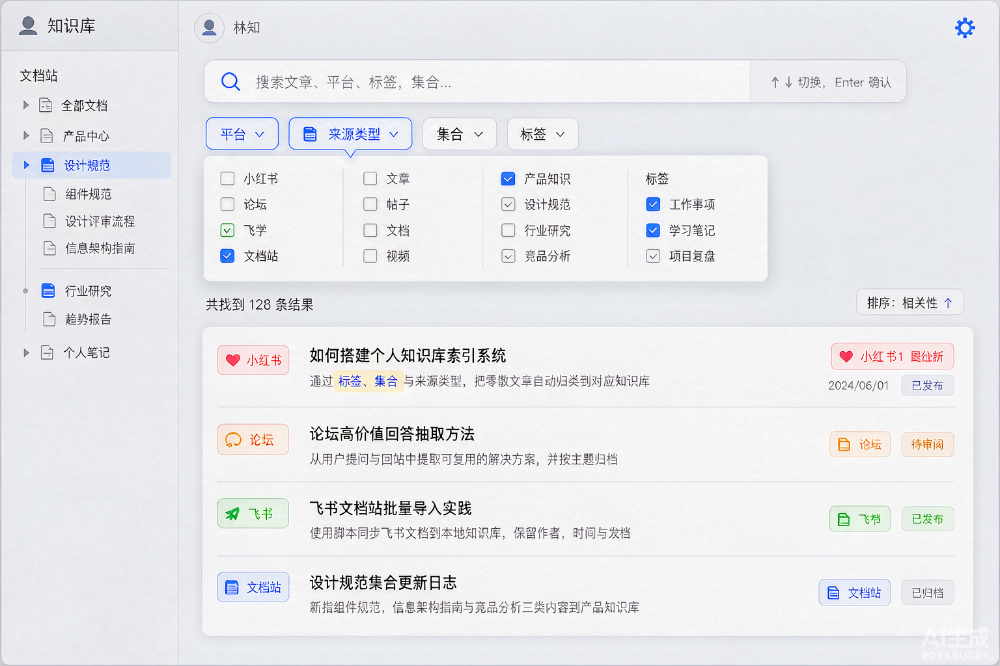
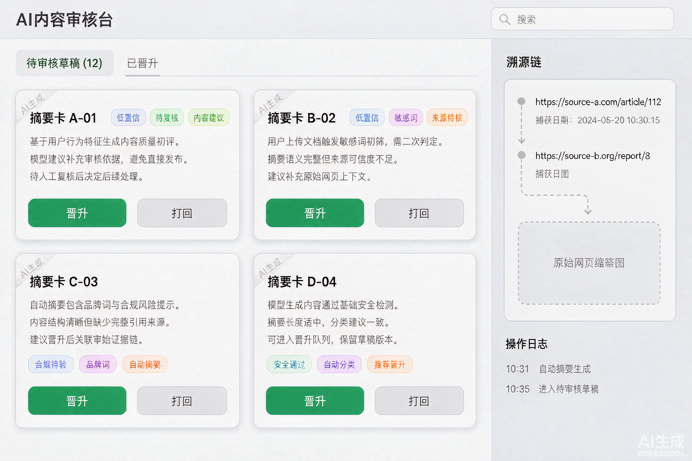
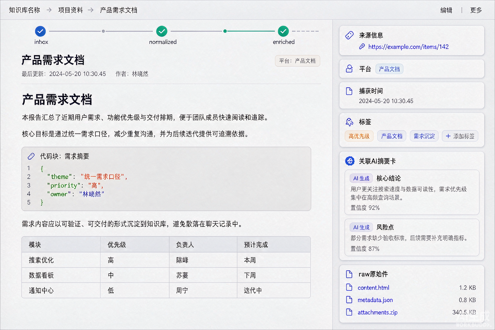
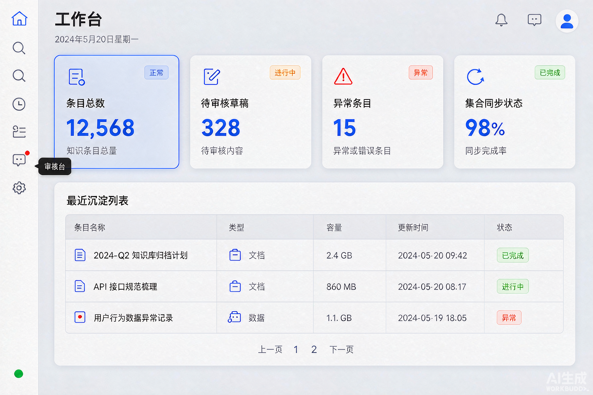

# 个人知识沉淀与 AI 工作台 · 方案文档

> 版本：v0.16（P2c 实施口径：D 类同步引擎——目录树遍历 + 增量 diff + Collection 任务 API，首个实例火山引擎文档站）
> 日期：2026-10-02
> 状态：架构方向与五项技术决策均已拍板（见第 9 节）；风险审查见第 8 节；角色建模见第 10 节；模块架构/职责卡/参数设置页/系统架构图/UI 方案参考见第 11 节；AI 协作规则见 `.codebuddy/rules/`（本文件为其设计事实源）

---

## 1. 需求定义

### 1.1 一句话需求

把互联网上看到的内容沉淀为个人知识库，沉淀能力归属于一个**尚未定型**的个人 AI 工作台。

### 1.2 四个关注点

```
① 采集    多平台、多入口，把内容拿进来
② 存储    统一格式落盘，成为长期数据资产
③ 整理    AI 自动加工（总结/标签/摘要卡），回流库中（依赖 ①② 的产出格式）
④ 工作台  未来形态未定的消费层（视图 + AI 交互）（消费 ①②③ 的产出）
```

### 1.3 核心结论

**④ 未定型，所以 ①②③ 必须做成与工作台无关的独立系统。**
管道的产出是"通用工具可直接读取的本地文件资产"（Markdown + frontmatter + 原始件），工作台只是后来的一个客户端。工作台选型（Obsidian、自研 Web、现成 AI 工具）不影响也不阻塞管道建设。

### 1.4 已确认的边界条件

| 决策     | 内容                                                   |
| -------- | ------------------------------------------------------ |
| 存量关系 | 全新项目，不涉及任何历史系统迁移                       |
| 采集入口 | 双入口并重：日常随手剪藏（高频）+ 专项批量抓取（低频） |
| AI 形态  | 优先自动整理（异步流水线），而非对话式问答             |
| 部署形态 | 本地为主 + 移动端可随手沉淀（需要轻量常驻服务）        |

---

## 2. 来源分类

来源不只按平台分，更要**按沉淀粒度**分——单条流与集合同步是两种一等公民。

| 类别                        | 例子                                                   | 内容特征                                         | 沉淀策略                           | 粒度               |
| --------------------------- | ------------------------------------------------------ | ------------------------------------------------ | ---------------------------------- | ------------------ |
| **A. 社交内容**       | 小红书、抖音、快手                                     | 单条、碎片、反爬强、视频为主                     | 剪藏为主，批量后置                 | 单条流             |
| **B. 社区论坛**       | 各类论坛                                               | 帖子流、按作者/关键词批量                        | 传统抓取                           | 单条流             |
| **C. 协作在线文档**   | 飞书/腾讯文档/Notion/语雀上的"我的/共享给我的"文档     | 私有、需要登录态、单篇导出                       | 官方 API 导出，按需单篇/按目录拉取 | 单条流             |
| **D. 公开产品文档站** | `docs.volcengine.com`（ByteHouse 指南）、各类 docs.* | 公开、成体系（目录树/多级导航/数百页）、持续更新 | 站点级批量抓取 + 增量同步          | **集合同步** |

### 2.1 D 类的独特性（区别于 C 类的三个要点）

1. **粒度是"站点/目录树"而非"单篇"**——沉淀一套产品文档意味着一次拿几十上百页，不可能手动剪藏。
2. **有结构层级**——产品 → 版本 → 章节 → 页面，落盘必须保留这棵树，否则知识库退化成一堆散页。
3. **活文档**——官方文档持续更新，沉淀一次即过时，需要**定期增量同步**（变更才更新，保留版本差异意识）。

### 2.2 平台策略与优先级

优先级标注与第 7 节路线图阶段一一对应（机械核查项）。

| 平台             | 路径                                                                                      | 优先级 |
| ---------------- | ----------------------------------------------------------------------------------------- | ------ |
| 任意网页         | 浏览器扩展剪藏（正文提取）。**P0 指服务端 capture+归一化链路；浏览器扩展本体在 P1** | P0/P1  |
| 飞书文档         | 官方 OpenAPI 导出，最稳，无需对抗                                                         | P2a    |
| 论坛             | 传统抓取 adapter                                                                          | P2b    |
| 产品文档站       | 可配置目录树抓取器，首个实例：火山引擎文档站                                              | P2c    |
| 小红书/抖音/快手 | 先靠剪藏沉淀；视频类批量抓取单独立项（涉及字幕 ASR，成本高）                              | 后置   |

**关键取舍**：小红书/抖音不走批量爬虫优先——反爬对抗成本高且不稳定，而"看到好内容随手存"恰好是这类内容最真实的使用场景，剪藏入口天然覆盖。

---

## 3. 总体架构

```
入口层                          管道层                     数据层
┌────────────┐                 ┌──────────────────┐
│ 浏览器扩展   │ ┐               │ inbox 暂存队列     │        ┌─────────────────┐
│ 手机分享/快捷│ ┼─ HTTP API ──▶ │   ↓ 归一化        │ ────▶ │ kb/ 本地目录      │
│ 指令        │ │   (常驻轻服务) │   ↓ AI 整理(异步)  │        │ md + raw + meta │
│ 批量爬虫    │ ┘               │   ↓ 索引          │        │ + SQLite 索引    │
└────────────┘                 └──────────────────┘        └─────────────────┘
```

### 3.1 三条设计原则（铁律）

1. **文件系统是唯一事实源。**
   SQLite/向量库只是可重建的索引缓存。这保证将来无论工作台选什么，都能直接挂载数据，系统不被任何前端绑架。
2. **入口多样性，出口唯一性。**
   剪藏、爬虫、飞书 API 各写各的 adapter，但落盘只有一种格式。新增平台 = 新增一个 adapter，管道零改动。
3. **管道分阶段、可断点、失败可观测。**
   每个条目带 `status: inbox → normalized → enriched`（外加失败态 `error`，见 4.2），任何一步中断都能续跑；失败的条目进入 `error` 态并记录失败阶段与原因，可重跑复活，不静默丢失。

### 3.2 调度模型：两种队列

- **单条流队列**（A/B/C 类）：一次一条，随到随处理，剪藏/API 导出均入此队列。
- **集合任务队列**（D 类）：一个 collection = 一个长驻同步任务（全量首抓 → 周期性 diff → 只落变更页）。

两种模式共用同一入口 API 与归一化出口，仅调度与增量逻辑不同。

> 本节为概念概览；模块级拆解、职责卡与部署视图见第 11 节。

---

## 4. 数据 Schema（v0 草案）

### 4.1 目录结构

```
kb/
├── inbox/                       # 捕获后未归一化的暂存
├── sources/                     # A/B/C 类：单条沉淀
│   └── <platform>/<年>/<条目id>/
│       ├── note.md              # 归一化正文 + frontmatter
│       ├── raw/                 # 原始件（html/截图/图片/视频元数据）
│       └── meta.json            # 程序元数据（与 frontmatter 职责分离，见 4.4）
├── collections/                 # D 类：文档站集合
│   └── <collection-id>/
│       ├── collection.json      # 站点配置 + 同步状态
│       ├── toc.json             # 目录树快照（含每页 content_hash，diff 依据）
│       └── docs/<章节路径>/
│           ├── <页面>.md
│           └── raw/
├── wiki/                        # AI 产出的摘要卡/概念卡/实体卡（隔离区，schema 见 4.5）
└── index.db                     # 全文/向量索引（可重建）
```

运行时路径约束：目录字面量一律 ASCII（占位符 `<platform>`/`<章节路径>` 等在落盘时须替换为 ASCII 安全值）；Windows 下注意路径长度（见 5.3）。

### 4.2 frontmatter 核心字段（A/B/C/D 类条目通用）

```yaml
---
id: <唯一条目id>
url: <来源url>                       # 解析重定向后的 canonical URL
platform: <开放枚举，小写>            # xiaohongshu / douyin / kuaishou / forum / feishu / volcengine / tencent_doc / notion / yuque / web（兜底）；新增平台 = 注册新值
source_type: social | forum | collab_doc | product_doc   # 管道分流依据
captured_at: 2026-10-02T12:00:00+08:00
title: <标题>
status: inbox | normalized | enriched | error            # 管道阶段标记；error 态详情记 meta.json
tags: []
collection: <collection-id>                               # D 类必填，其余省略；D 类来源定位以 collection 为主、platform 为辅
ai:                                                       # 仅 enrich 阶段后存在
  summary: <摘要>
  confidence: <0~1 浮点，模型自评置信度>                    # v0.17：§11.7 偏差拍板采纳
  model: <模型标识>
  generated_at: <时间>
---
```

**status 载体说明**：capture 阶段产出的是原始 payload（尚无 frontmatter），状态记在同目录 sidecar `capture.json`（`url / captured_at / status: inbox / entry: browser_ext | mobile_share | crawler | collab_api | cli`，按入口通道分类，互斥；`cli` 为 P0 命令行投递通道）；normalize 生成 `note.md` 后状态迁移到 frontmatter。**error 态**：附加 `error_stage` 与 `error_message`（记于 meta.json，见 4.4），重跑成功后清除并回到前一状态。

### 4.3 collection.json 与 toc.json

collection.json：

```json
{
  "id": "volcengine-bytehouse",
  "name": "ByteHouse 企业版文档",
  "entry_url": "https://docs.volcengine.com/docs/ByteHouseEnterpriseEdition/list?lang=zh",
  "url_pattern": "<页面 URL 匹配规则>",
  "toc_parser": "<目录树解析方式>",
  "sync": {
    "last_synced_at": "<上次同步时间>",
    "changed_pages": ["<变更页路径清单，增量同步断点依据>"]
  }
}
```

toc.json：目录树结构 + **每页 `content_hash`**（diff 依据：结构 diff 用树对比，内容 diff 用 hash）。`changed_pages` 由 diff 结果生成。**所有状态类 JSON（collection.json / toc.json / capture.json）写盘一律原子写（临时文件 + rename），防止进程中断产生半写文件。**

### 4.4 双文件职责分离与两条纪律

**meta.json 与 frontmatter 职责交集为空（防双写漂移）**：

| 文件                    | 定位                            | 独占内容                                                                                                                                                                                                                  |
| ----------------------- | ------------------------------- | ------------------------------------------------------------------------------------------------------------------------------------------------------------------------------------------------------------------------- |
| `note.md` frontmatter | 人机共同接口（工作台/用户读写） | 4.2 所列字段（`ai.*`、`tags` 可被更新）                                                                                                                                                                               |
| `meta.json`           | 程序消费，人工不改              | `content_hash`、`original_url`（短链等非规范来源）与重定向链（canonical URL 只存 frontmatter `url`，避免双写）、`error_stage`/`error_message`、raw 文件清单、抓取指纹、`enrich.log`（enrich 操作流水，v0.17） |

两条纪律：

1. **AI 内容强制溯源**：`wiki/` 所有卡片带 `ai_generated: true`，与原始沉淀物理隔离；仅 `status: promoted`（人工确认）的卡片可被索引与工作台图谱引用——防止自动整理污染库的准确性。
2. **写入边界白名单（字段级）**：管道各环节只允许写自己的目标区，越界直接拒绝并计数；字段级细化——
   - normalize：只写 `sources/`（或 `collections/` 下对应页）与 `inbox/` 清理；
   - enrich：对源条目**仅允许写 frontmatter 的 `ai.*` 与 `tags` 两个字段**，其余一律禁写；卡片产物只写 `wiki/`；源条目含 A/B/C 类（`sources/`）与 D 类（`collections/<id>/docs/**`）两者，区域白名单必须同时覆盖（v0.34 修订，见下方实施口径）；
   - sync（D 类）：只写 `collections/<id>/` 内部；
   - aggregate（concept 聚合，v0.40）：只写 `wiki/`（普通写；不涉及破坏性写。新增 stage 必须同时核对普通写与破坏性写两张区域白名单表，v0.34 教训）；
   - curation（人工处置，v0.17）：审核台处置经 API 走守卫——晋升（wiki 卡 `status` 补丁）、打回（删除卡 + 源条目 `status` 回 `normalized` 并清零重试计数）、删除（物理删除 wiki 卡）；打回的源条目复位同样覆盖 D 类（v0.34）；**修订草稿正文**（v0.35：仅 `draft` 态，整份卡经守卫原子写回，`edited_at` 留痕，`ai_generated`/`status` 不变）。

> **写边界按操作分域（v0.34 实施口径）**：`collections/` 是源站镜像，允许**非破坏性写**（字段级补丁与 `meta.json` 状态/流水写），禁止**破坏性写**（物理删除文件/目录、整树移动）。因此守卫的区域白名单分两张：普通写（`write_text/bytes/json`、`patch_note_fields`）按 stage 区域集放行，破坏性写（`remove_path/remove_tree/move_tree`）另用收窄后的区域集——`collections/` 不在其中。v0.20「D 类镜像不删」的保护由后者继续承担，端点语义不变（`DELETE /api/entries/{id}` 仍只作用于 `sources/` 条目，D 类天然 404）。历史缺陷：v0.16 引入 D 类页后只给 `normalize` 放行了 `collections/`，`enrich`/`curation` 未同步，导致 D 类页整理 500（D 类页就在 `collections/`，却是 enrich 的合法目标集——`enrich` 扫描/试跑/流水聚合都遍历两区）。

> 条目删除处置实施口径（v0.20，用户拍板选项 A）：源条目（`sources/`）支持从工作台删除（`DELETE /api/entries/{id}`，走 curation 守卫通道，物理删除整个条目目录含 raw/，UI 二次确认）；删除后索引随查询时懒同步自动移除（增量 diff 的 removed 通道，无独立"删索引"操作——索引是语料镜像，铁律 1）。**D 类 collection 页面不支持删除**：collection 是站点镜像（§4.3），本地删除后下次同步 diff 会重新抓回，镜像内容的管理职责在源站；实现上条目语料只扫 `sources/`，collection 页天然不在端点范围（404），curation 守卫区域白名单（wiki/sources）确保未来语料扩展也不会误删 `collections/`。`inbox/` 条目删除走独立端点（v0.21 补充）：`DELETE /api/inbox/{id}` 物理删除 `inbox/<id>/` 整目录（capture.json + 原始 payload），curation 守卫区域扩展至 inbox——与"重跑复活"并列的废数据出口（error 条目永久不可修复、或误投递时使用），总览页 error 巡检行内操作。

> 库分区重置实施口径（v0.44，用户拍板范围 = **部分重置**页面化，全量重置仍由 `scripts/reset_kb.ps1` 承担）：`POST /api/kb/reset` 物理删除 `kb/` 下指定分区（`inbox`/`sources`/`collections`/`wiki` 的**非空子集**，不允许全选）并重建空目录。新增守卫 stage `reset`：普通写与破坏性白名单均含四区——破坏性表含 `collections/` 是对 v0.20"镜像只可写不可删"的**显式例外**，语义不同：重置 = 废弃整个镜像（`collection.json` 一并删除即注销注册，sync 引擎不再 diff 抓回），单页删除会被下次同步重新抓回故仍禁止。`index.db` 不删（被服务进程 SQLite 连接持有，进程内无法删除；索引是语料镜像，重置后查询时懒同步 removed 通道自动移除已删条目）；RAG 派生向量库同理不自动重嵌（涉外部费用），UI 提示手动重建。API 强制 `confirm: "RESET"` 显式确认；可选 `backup: true` 在重置前整库备份到库同级 `kb-backup-<时间戳>`（排除 `index.db`，同备份脚本口径）。

### 4.5 wiki 卡约定

```yaml
---
id: <wiki卡id>
type: summary | concept | entity   # entity=v0.40 知识图谱实体卡（受控 schema 抽取，§9 决策 6）
ai_generated: true
status: draft | promoted          # draft=AI 产出待确认；promoted=人工确认，可被索引/图谱引用
sources: [<sources条目id 或 collection页id>, ...]   # 溯源引用
confidence: <0~1 浮点，模型自评置信度>               # v0.17：与源条目 ai.confidence 同值
created_at: <时间>
model: <生成模型>
edited_at: <时间>                # 可选，v0.35：人工修订草稿的时间（无此字段=纯 AI 产出）
---
```

id 规则：`w-` + SHA-1（`<源条目id>:<type>`）前 12 位——确定性生成，同源同类型卡幂等覆盖，enrich 重跑不产生重复卡。

v0.40 扩展（知识图谱双层，§9 决策 6）：

- **entity 实体卡**：enrich 阶段追加任务 `entity_extraction`，per-条目 LLM 抽取实体与关系，输出受全局 schema 白名单约束（`ai.kg.entity_types`/`ai.kg.relation_types`，代码内置默认、设置页可编辑，全局一份不做 per-collection 定制）。frontmatter 增四字段：`name`（规范名）、`aliases`（别名列表）、`entity_type`（白名单内）、`relations`（`[{type, target, name}]`，target = 目标实体卡 id）。id = `w-` + SHA-1（`entity:<规范名小写>`）前 12 位——**同名确定性合并**（重跑幂等覆盖，`relations` 合并去重）；首版不做模糊消歧，别名归集与模糊对齐明确后置。实体卡只写 `wiki/`，不回写源条目（enrich 字段白名单 `ai.*`/`tags` 不变）。
- **concept 概念卡**：enrich 完成后的二级自动聚合（新增 stage `aggregate`），输入 = `wiki/` 实体卡与 enriched 条目，LLM 聚类产出概念卡草稿——**先自动、后人工复核**：自动产物一律 `draft`，晋升/打回/删除走 curation 既有三处置，无自动晋升通道。id = `w-` + SHA-1（`concept:<规范标题小写>`）前 12 位。触发沿用 `ai.trigger_mode` 门控与熔断口径，聚合失败计入熔断统计。
- 两型卡正文构成纪律与来源行规则同 summary 卡（模型产出 + 模板标题 + 末尾可点来源行）；`sources` 允许多条目（concept 天然多来源），来源行按条目逐行列出。

晋升机制：人工将卡片 frontmatter 的 `status` 由 `draft` 改为 `promoted`（工作台 UI 或直接编辑均可）；无批量自动晋升通道。

正文构成纪律（v0.35）：卡正文 = **模型产出**（`card`）+ 模板补的一级标题（模型自带则不补）+ 末尾来源行。来源行必须是**完整可点链接** `> 来源：[<条目id>](<原文URL>)`，无 `url` 的条目降级为 `> 来源条目：<id>`——禁止写成 `[id]` 这种残缺 Markdown 链接语法（渲染后是裸方括号，等于没有溯源）。审核台展示须让人一眼看出「哪部分是 AI 写的、哪部分是模板补的」：至少并列呈现模型摘要 `ai.summary`、AI 标签 `tags`、生成模型/时间/置信度，卡正文按 Markdown 渲染而非源码。

人工修订（v0.35，用户拍板对齐业界 edit-before-accept）：**仅 `draft` 态可经 API 修订正文**（`PUT /api/wiki/{card_id}`，走 curation 守卫通道写 `wiki/`），成功后打 `edited_at` 留痕并保持 `ai_generated: true` 与 `status: draft`——即"人工修订过"只加时间戳，不改 AI 溯源标记，UI 需显示"AI 生成 · 已人工修订"以免人工背书被误认为纯 AI 产出。`promoted` 卡不可修订（已是索引/图谱引用源，改动须先打回重走审核）；修订不得清空正文；晋升仍是唯一放行通道且仅人工触发。

---

## 5. 管道设计

### 5.1 阶段定义

| 阶段      | 输入            | 输出                                             | 写边界                 | 说明                                                                                 |
| --------- | --------------- | ------------------------------------------------ | ---------------------- | ------------------------------------------------------------------------------------ |
| capture   | 各入口          | `inbox/<id>/` 原始 payload + `capture.json`  | `inbox/`             | 原样保存，不做加工                                                                   |
| normalize | inbox           | `sources/` 或 `collections/` 条目            | 各自目标区             | 正文提取、转 Markdown、frontmatter 生成、写边界校验；动态页兜底（Playwright，v0.17） |
| enrich    | normalized 条目 | `wiki/` 摘要卡 + 源条目 `ai.*`/`tags` 回写 | `wiki/` + 源条目白名单字段（`sources/` 与 `collections/` 两区，v0.34） | 异步、带重试与断点；失败 → 条目转`error` 态，不阻塞主链路                         |
| index     | 落盘成果        | `index.db`                                     | `index.db`           | 落盘后增量更新，定期全量重建校准；可随时删除重建                                     |

> enrich 实施口径（v0.14）：编排器周期扫描 `status: normalized` 的源条目批量加工（D 类变更页同流程），另支持经 Query·运维 API 手动触发；失败不阻塞 normalize 主链路。断点与重试载体：重试计数记 meta.json `enrich.attempts`，超限后源条目转 `error` 态（`error_stage: enrich`、`error_message` 记 meta.json），可人工/指令重跑（重置回 `normalized`）；enrich 成功后 frontmatter `status: enriched`。任务分级落地（§9 决策 4 / §11.5 AI 分区）：`tags`（标签，便宜快模型）与 `summary_card`（摘要卡，强模型，摘要同时回写 frontmatter `ai.*`）两级随 P3 自动执行；`concept_card` 任务槽预留（配置存在，不自动生成，后续按需触发）。

> enrich 触发门控与试跑口径（v0.29，用户拍板，参考业界"金丝雀 + dry-run + 熔断"模式）：**`ai.enabled` 与"谁来触发"解耦**——`ai.enabled` 是 AI 总闸（允许发起任何 LLM 调用，含试跑；关掉即全面止损），新增 `ai.trigger_mode: manual | auto`（**默认 `manual`**）决定后台 worker 是否周期自动扫库：`manual` 下 worker 醒来不扫库，只有手动 API 指令才加工；`auto` 下每 `ai.poll_interval` 秒扫一批（`ai.batch_size` 条、批内 `ai.concurrency` 并发）。三档操作面：**试跑（dry-run）→ 单条/一批 → 全量自动**，前两档任何时候都可用（不受 `trigger_mode` 限制），第三档需显式切 `auto`。
>
> 试跑（dry-run，`POST /api/enrich/preview?entry_id=`）：对指定条目跑 `tags` + `summary_card` 两个任务并返回结构化结果（解析后的标签、卡片 Markdown、置信度、实际后端、耗时），**零落盘**——不写 `wiki/`、不改源条目 frontmatter、不计 `enrich.attempts`、不写 `enrich.log`（不写盘即不触碰写边界守卫，无需新增白名单）；入口拆分口径：`enrich.plan_entry()` 负责"调模型 + 解析"并返回结果，`enrich.enrich_entry()` = plan + 落盘，**两者共用同一 prompt 与解析代码**，杜绝"预览与实际执行不一致"。试跑同样受 `ai.enabled` 门控（总闸语义完整：关掉即任何 LLM 调用都不发生），但不受 `trigger_mode` 限制。
>
> 手动批量口径：`POST /api/enrich/run` 带 `entry_id` = 单条同步执行；**不带 `entry_id` = 同步执行一批**（`batch_size` 条）并返回逐条 outcome 汇总（`enriched`/`retry`/`error` + 失败原因），使"跑一批"在 UI 上有即时可读反馈（`auto` 模式同样允许手动跑一批）。
>
> 熔断（circuit breaker，仅 `auto` 模式生效，防止模型名配错 etc. 把全库刷成 error）：`auto` 下每轮扫描后统计 outcome，**整轮无成功（`enriched == 0` 且 `retry + error > 0`）** 记 `ai.breaker.consecutive_failures += 1`，任一轮有成功即清零；达 `ai.breaker_threshold`（默认 3）置 `ai.breaker.state = open` 并**静默停止自动扫描**（页面显著提示 + 说明"修正模型配置后点恢复"）。注意失败口径含 `retry`：模型不可达/超时/输出不可解析时重试未超限的条目 outcome 是 `retry`，只看 `error` 会漏判整轮失败。`open` 期间手动 `run`/`preview` 不受门控（人不受自动化门控）；**恢复只经显式动作**（`POST /api/enrich/breaker/reset`），程序不自动恢复——避免自我判断是否已修好。熔断运行态落 `ai.breaker`（`state`/`consecutive_failures`/`opened_at`/`last_error`）于配置文件：与用户配置分区并列、经配置中心原子写（配置文件不属 `kb/` 库文件、不经写边界守卫，§11.5 已定），程序**只写该子字段、不触碰其他键**。
>
> 生效机制修正（v0.29）：`ai.poll_interval` 改为**每轮实时读取**（此前启动时读进线程，运行中改配置不生效，导致"逐条手动"必须重启服务）。
>
> 知识图谱实施口径（v0.40，§9 决策 6）：知识图谱 = 受控 schema 的 entity/concept 双层，浏览型起步。
> ① entity 抽取：enrich 追加任务 `entity_extraction`（per-条目，随既有 tags/summary_card 批次执行，试跑 `preview` 同步纳入），输出受 `ai.kg` 白名单约束；实体卡 id 同名确定性合并（`relations` 合并去重），只写 `wiki/` 不回写源条目。
> ② concept 聚合：新增 stage `aggregate`（编排器在 enrich 批次后执行），输入 = `wiki/` 实体卡与 enriched 条目，LLM 聚类产 draft 概念卡；**先自动、后人工复核**——无自动晋升；触发沿用 `trigger_mode` 门控与熔断口径（聚合失败计入熔断统计，失败口径含 retry），`manual` 下仅响应手动指令。守卫普通写区域 = `wiki/`，不涉及破坏性写。
> ③ 边表派生：关系事实源在实体卡 frontmatter `relations`（铁律 1，禁止边数据只存数据库）；index 阶段同步派生 `kg_edges` 表（src/dst/type，target 卡不存在则丢弃该边）进 index.db（可重建缓存）；**仅 `promoted` 卡进图谱**（对齐纪律 1，draft 不入图）。
> ④ 图谱消费浏览型起步：`GET /api/graph` 返回节点（promoted 实体卡 id/name/entity_type）+ 边（含双向跳转 card id）；前端图谱页后置批次实现；GraphRAG 式 local/global 检索明确后置，实测检索不足再评估，不预设。任务分级：`entity_extraction`（中档模型）为新增任务槽；concept 聚合**复用既有 `concept_card` 任务槽**（v0.41 勘误：原拟新增 `concept_merge`，与预留槽指向同一产物，复用避免死配置）
>
> index 实施口径（v0.15）：索引引擎无独立后台线程，采用**查询时懒同步**——检索 API 每次调用前做语料签名比对（TTL 限频，默认 5 秒内不重复扫盘），按文件（rel + mtime_ns + size）增量增删 FTS 行；分词/语料口径标识（jieba 版本 + 切分模式 + 语料版本）记入 index.db meta 表，口径不一致自动全量重建。语料范围：`sources/`、`collections/` 下 `status ∈ {normalized, enriched}` 的 note.md 与 `wiki/` 全部卡片（frontmatter 剥离后标题 + tags + 正文入索引；error 条目走状态页呈现，不入检索）。全量重建经 `POST /api/index/rebuild` 指令下发（重建 = 删库重扫，可随时删除重建）。index.db 路径经写边界守卫（index 阶段 → `index.db`）解析，SQLite 直接读写该文件即守卫授权通道；检索接口 `GET /api/search`，MATCH 表达式由 segment 产物经唯一构造函数逐 token 引号包裹生成（空产物返回空结果、不拼 MATCH）。

> normalize 实施口径（v0.17，Playwright 动态页兜底）：HTTP 抓取失败或正文提取为空、且 payload **无选中文本**时，若 `normalize.playwright_fallback` 开启（默认开启），经 Playwright 无头 Chromium 渲染（`wait_until: networkidle` + 渲染余量）后重试抓取与提取；渲染后 HTML 即为 `raw/page.html` 原件（raw 升级为渲染后页面），meta.json `fetch.via: "playwright"` 区分于直连（`"http"`）。带选中文本时维持既有降级策略，不触发 Playwright（职责卡口径）。Playwright 未安装或启动失败：转 `error` 态（error_message 含安装提示 `pip install playwright && playwright install chromium`），可观测、可重跑复活；不静默跳过。重依赖延迟导入：不开兜底或未触发时零加载成本。

> 可浏览快照实施口径（v0.43）：SPA 空壳与渲染态 DOM 在本地直接打开时会被内嵌脚本重渲染出"页面无法访问"假 404（脚本对 `file://` 无 CORS 凭据、且正文不在字节里），故 normalize 落盘 HTML 原件时**旁路生成可浏览快照 `raw/page.view.html`**——`raw/page.html` 原件字节不变（§5.3 第 2 条纪律），快照构造 = 剥 `<script>/<noscript>` + 注入 `<base href="final_url">`（联网打开时 CSS/图片按原站地址加载）+ 统一 utf-8。生成条件：① SPA 空壳（剥脚本后可见文本 < 200 字符）——空壳且兜底开启时经 Playwright 渲染一次取真实 DOM（带选中文本的降级条目也渲染，仅用于快照、不改变正文提取策略）；② `fetch.via=playwright` 的渲染态 DOM（不再重渲染，直接构造）。渲染失败降级为对原始件剥脚本（至少不再被脚本重渲染成错误页）。静态正文页（可见文本充足）不生成快照。meta.json `raw_files` 增补 `raw/page.view.html`（str 形状，同 page.html）。

> index 向量增强实施口径（v0.17，P4 收尾）：sqlite-vec 扩展挂载于同一 index.db（可重建派生库，边界不变），`vec0` 虚拟表与 FTS 同语料同懒同步口径；embedding 调用复用 provider 表——`ai.tasks.embedding` 任务槽（provider/model/dimensions），OpenAI 兼容 `/embeddings` 端点，api_key 同 env-only 纪律。**开关 `index.vector_enabled` 默认关闭**（embedding 调用涉外部费用）；关闭时只建 FTS，语义检索返回明确提示。口径标识（provider+model+dimensions）入 index.db meta 防混存，不一致时语义检索拒绝并提示经 `POST /api/index/rebuild` 人工重建（不自动重嵌，避免静默外部费用）。KNN 查询须在 vec0 表显式 `k = ?`（JOIN + LIMIT 不被识别，txxy_test 已踩坑）。检索 `GET /api/search` 增 `mode=semantic`（默认 `fulltext` 不变）。

> 启动期依赖自检实施口径（v0.36）：`jieba`（中文分词）、`sqlite-vec`（向量）、`playwright`（动态页兜底）在代码里均为**延迟导入**（省启动耗时），缺装不在启动时暴露，只在用户点某条路径时变成无信息 500（实跑踩坑：检索页输入任意词稳定 500，根因缺 `jieba`，而 `/api/index/status` 不触发分词故返回 200，排查方向一度被带偏）。故服务启动（lifespan）统一自检第三方依赖：① **必需依赖缺失 → 拒绝启动**，错误信息给出当前解释器的 `pip install -r requirements.txt` 命令与受影响功能（宁可不启动，不提供半可用服务）；② **可选依赖缺失 → 仅告警**，对应功能走各自既有降级口径（语义检索 409、动态页兜底抛带安装提示的 `RuntimeError`），既不静默也不拖垮其它功能。自检用 `importlib.util.find_spec` 探测存在性而非真导入，不给启动加词典加载开销。
>
> 索引库异常口径（v0.36）：索引懒同步与索引状态读取捕获 `sqlite3.Error` **全族**（此前只捕 `OperationalError`，漏了父类 `DatabaseError`，库损坏时异常穿透成无信息 500），降级为"用现有索引继续检索"但必须记服务端日志；`GET /api/search` 的 MATCH 查询异常转 **503 + 可读原因 + 重建入口**（区别于 409 的"配置/口径问题"）。

### 5.2 D 类集合同步流程

```
注册 collection → 全量首抓（遍历目录树）→ toc.json 快照（含每页 content_hash + 目录节点标题 dirs，v0.24）
     ↑                                        ↓
     └──── 周期性 diff（目录树对比 + content_hash）←──┘
                    ↓ 仅变更页（写入 changed_pages，原子写）
              重新归一化落盘 → 更新 sync 状态
```

页面更新策略与单条流一致（见 5.3 第 4 条）：同路径 content_hash 变化 → 覆盖 `note.md`，旧版 raw 归档。

> sync 实施口径（v0.16，P2c）：D 类同步引擎（kbserver/sync.py）无独立后台线程，**注册 collection 时触发全量首抓，增量同步经 Collection 任务 API 手动下发**（个人规模无定时需求，需要时再后置周期调度）。站点解析器（`toc_parser`）按站点在 sync 引擎内注册，首个实例火山引擎文档站——经其**公开 JSON API** 获取目录树（`getDocList?LibraryCode=<code>`，返回扁平节点表，`Type` 区分目录/页面）与正文（`getDocDetail?DocumentID=<id>`，`MDContent` 字段直出 Markdown，无需 Playwright 渲染）；纯 SPA 站点不抓 HTML 壳，数据 API 即结构化来源。diff 口径：目录树对比（节点增删）+ 每页 `content_hash`（对 MDContent 计算）——产出三类：**added / changed**（记入 `changed_pages` 原子写，逐页走归一化落盘，`entry: crawler`）与 **removed**（下架页仅从 toc.json 移除并记入 sync 状态清单，落盘文件保留为历史件、不物理删除，人工裁决）。D 类页面 id 依据 §9 决策 1：SHA-1(`collection-id` + 站内路径) 前 12 位；站内路径 = CanonicalURL 路径（页面 URL 查询参数不稳定；v0.27 修正：站点 API 的 CanonicalURL 与实际路由不符——实测含 `/doc/` 段的 URL 404，真实 URL = `/docs/{LibraryCode}/{DocumentCode}?lang=zh`，DocumentCode 全表唯一）。章节落盘路径 = 目录树 DocumentCode 链路清洗后的 ASCII 相对路径（限长，见 5.3 第 6 条）；正文 Markdown 已由站点直出时跳过 trafilatura，仅做相对链接后处理与 frontmatter/meta 生成（复用归一化引擎）。

### 5.3 已知坑位（提前设防）

1. **文档站相对链接**：转 Markdown 后必须后处理站内相对 URL（统一改写为绝对 URL 或降级为纯文本），否则脱离原站后交叉引用全是断链。
2. **正文提取质量分层**：公开文档站结构规整，可做到接近无损转换（表格/代码块）；社交平台提取质量天然参差，raw 原件永远保留，便于重新提取。
3. **AI 回流审核**：自动打标签/摘要可能不准确，一律先进 `wiki/` 隔离区（draft 态）。
4. **同 URL 内容更新**：判重以规范化 URL 幂等；同 id 的 `content_hash` 变化时更新 `note.md` 并将旧 raw 归档至 `raw/<归档时间戳>/`，不覆盖历史原始件。**短链**（t.co、xhslink 等）：capture 时解析重定向，以最终 canonical URL 判重；`original_url` 记于 meta.json。
5. **图片防盗链**：社交/文档站图片多带防盗链，外链会失效——随抓取本地化至 `raw/`，`note.md` 引用本地相对路径。
6. **Windows 路径长度**：D 类深层章节路径可能超 MAX_PATH——章节路径落盘前清洗（限长、必要时编号化），或启用系统长路径支持。

---

## 6. 部署形态

- **常驻轻服务**（本地进程）：暴露 HTTP API（capture 入口、集合任务管理、状态/运维、检索——检索 P4 起提供：`GET /api/search`、`POST /api/index/rebuild`，见第 11 节 Query/运维 API），附带最小 Web UI，其核心即**参数设置页**（§11.5）。
  - Collection 任务 API（P2c 起提供，token 鉴权同 capture）：`POST /api/collections`（注册 collection：id/name/entry_url/LibraryCode，落 `collections/<id>/collection.json` 后触发全量首抓）、`GET /api/collections`（清单与同步状态）、`POST /api/collections/{id}/sync`（手动增量同步指令；`collection.json` 不存在时 404，toc.json 缺失时按首抓处理）；v0.50 增 `PATCH /api/collections/{id}`（更新集合元数据 name/entry_url：至少一项否则 400；entry_url 校验同注册并**重算 url_pattern**、platform 不一致 → 400——换平台 = 换 adapter 须重注册；toc_parser/site 等结构性字段不可改；**不触发重抓**——同步靠 toc diff，抓取行为由 toc_parser/site 决定与 entry_url 无关；写盘沿用 sync 守卫通道）。
  - 工作台与人工处置 API（P5 起，v0.17）：`GET /api/wiki`（wiki 卡清单，`status` 过滤，带 `ai_generated`/`confidence` 溯源）、`GET /api/wiki/{card_id}`（卡详情）、`POST /api/wiki/{card_id}/promote|regenerate|delete`（三处置，走 curation 守卫通道）、**`PUT /api/wiki/{card_id}`**（v0.35：修订 draft 卡正文，body `{body}`，仅 draft 可改，落 `edited_at` 留痕；非 draft → 409、空正文 → 400、卡不存在 → 404）、`GET /api/enrich/logs`（enrich 操作流水聚合，读 meta.json `enrich.log`）、`GET /api/parsers`（站点解析器注册表只读清单）、`GET /api/collections/{id}/toc`（目录树，文档树页数据源；v0.23 三态裁决：collection 不存在 → 404，已注册但首抓未完成（toc.json 未生成）→ 409 明确提示，正常 → 快照）、`GET /api/facets`（platform/source_type 过滤器枚举 = 注册表 ∪ 库内实际值）；v0.40 增 `GET /api/graph`（知识图谱浏览：promoted 实体节点 + 关系边，源自 index.db 派生边表，节点带卡片跳转 id）；`GET /api/search` 增 `mode=semantic`。v0.20 增 `DELETE /api/entries/{id}`（源条目删除处置，走 curation 守卫通道；collection 页面不在语料范围、404 兜底，见 §4.4 实施口径）。v0.21 增 `DELETE /api/inbox/{id}`（inbox 丢弃通道，curation 守卫区域扩展至 inbox，见 §4.4 实施口径）。v0.22 增 `POST /api/parsers/probe`（站点适配器探测：URL 匹配注册表 adapter + 提取站点参数 + 可选目录树实测验证，`GET /api/parsers` 元数据升级 `fields`（name/hint/placeholder，随 adapter 声明））。v0.29 增 AI 整理触发与试跑三端点（§5.1 enrich 触发门控口径）：`POST /api/enrich/preview?entry_id=`（**dry-run 试跑，零落盘**，返回解析后标签/卡片/置信度/实际后端/耗时，受 `ai.enabled` 门控、不受 `trigger_mode` 限制）、`POST /api/enrich/run`（带 `entry_id` 单条同步；**不带则同步执行一批**并返回逐条 outcome 汇总，替代 v0.14 的"仅唤醒 worker"）、`POST /api/enrich/breaker/reset`（显式恢复自动整理，清零熔断运行态）；`GET /api/status` 增 `ai_trigger_mode` 与 `ai_breaker` 供工作台展示。v0.28 增文档树页目录树导出（用户拍板，弥补原站"只能看不能导"）：**前端本地生成**（复用 `/api/collections/{id}/toc` 已加载树数据，纯只读、零后端改动、不涉写边界），三种格式——Markdown（嵌套大纲，目录加粗、页面 `[标题](原站URL)` 链接，头部注导出日期与页数）/ Word docx（多级缩进列表，页面条目带原站超链接）/ CSV（UTF-8 BOM，Excel 直接打开中文不乱码；列 = 路径,标题,类型,原站URL）；文件名 `toc-<collection-id>-<日期>.<ext>`，树序与源站侧边栏一致（v0.25 排序键）。v0.30 增**全文导出**（用户拍板"目录树=大纲、正文=内联"，Confluence 空间导出同类形态）：`GET /api/collections/{id}/export?format=zip|merged`——zip = `toc.md`（大纲 + 本地文件相对链接 + 原站 URL）+ `docs/**/note.md` 原文 + `raw/img-*` 图片（镜像磁盘布局，相对图片引用离线可用）；merged = 单文件 Markdown（大纲标题层级 + 页面正文内联 + 原文链接，error 页按标题占位标注"该页抓取失败"）；error 页信息取 `collection.json sync.errors`（不在 toc.json）。前端 docx 升级为**全文中保真版**（merged 内容经浏览器端 md→docx 转换：标题层级/段落/列表/表格/代码块；图片不含——以 zip 版为准，属格式转换固有损耗）。v0.31 导出口径定稿（用户四项拍板）：① **下线 CSV**（CSV 属清单格式，不承载正文，全文口径下无定位），目录索引导出仅保留 Markdown 大纲；② **Word 全文升级嵌图版**——前端取 merged 的 `images=api` 内部变体（正文 `raw/img-*` 相对引用按围栏感知改写为 `/api/collections/{id}/image?path=<页面路径>&name=<文件名>` API URL），逐图拉取并以 ImageRun 嵌入（尺寸自 PNG/JPEG/GIF/WebP 头解析，未知格式回退固定尺寸；单图拉取失败降级占位文本，不整体失败），新增只读端点 `GET /api/collections/{id}/image`（仅放行 `docs/**/raw/img-*`，防路径穿越，token 鉴权同 export）；③ **下载版 merged 维持相对图片引用**（完整图片以 zip 为准，头部有说明）；④ **zip 维持现状**（md 原文 + 图片镜像）。v0.44 增 `POST /api/kb/reset`（库分区重置：body `{regions, confirm: "RESET", backup?}`，regions 为四区**非空子集且不允许全选**；走 reset 守卫 stage 破坏性通道，index.db 不删、懒同步自动对齐，见 §4.4 实施口径；非法区/空集/全选/确认不符 → 400；`backup=true` 先整库备份到库同级 `kb-backup-<时间戳>`（排除 index.db）；全量重置仍由 `scripts/reset_kb.ps1` 承担，脚本同步支持 `-Regions` 按区选择）。v0.46 增：`GET /api/status` 状态汇总的 `inbox` 节点增 `by_entry`（按 capture.json `entry` 通道计数、含 error 项）、`enrich` 节点增 `pending_by_platform`（与 pending 同一遍历按 platform 分组，覆盖 sources+collections 两区）；v0.48 增：`enrich` 节点再增 `pending_by_region`（同源按来源区域分组）——总览页流程漏斗细分数据源。
  - 全文导出（v0.30 起，v0.32 标题命名定稿，均只读派生不涉写边界）：`GET /api/collections/{id}/export`——`format=zip`：**中文标题布局**（目录树目录标题=文件夹、页面标题=`<标题>.md`；正文去 frontmatter 为纯原文，`# 标题` 下附灰色原站 URL 行；图片集中至所在目录 `raw/` 相对引用离线可用；同层重名自动加序号 `-2/-3…`；Windows 非法字符/保留名清洗；error 页占位 md；`toc.md` 作索引）；`format=merged`：单文件全文（大纲=标题层级、正文内联按深度降级、每页附原站链接；图片三模式 `images=original`（**默认**，按 meta.json 映射改写回**原站图片 URL**，无映射回落 image API URL）｜`relative`（raw/img-* 相对引用，配 zip 使用）｜`api`（image API URL，docx 嵌图转换内部用））；`format=pages`：zip 的 docx 变体数据源（返回全量页面 JSON，**zip 内路径由后端统一计算 `zip_path`**（单一命名事实源），含 error 页记录与 `toc_md`，前端逐页转 docx（md→docx 转换器前端唯一，不新增 Python 依赖）后经 fflate 打包下载）。配套数据变更：normalize 图片本地化在 meta.json `raw_files` 记录原站映射（图片条目 `{path, src}`，非图片原件与未解析条目维持 `str`）；存量库经 `scripts/migrate_image_map.py` 一次性回填（默认 dry-run，`--apply` 写盘）。
  - **Web UI 前端工程（P5 形态拍板，v0.17）**：独立工程 `webui/`（Vite + Vue3 + TypeScript，无组件库、手写样式），构建产物提交至 `kbserver/static/` 由服务经 StaticFiles 托管（`/app` 入口）；开发态 vite dev server 将 `/api` 代理至本机 kbserver。页面六项：总览 / 检索 / 时间流 / 文档树 / 审核台 / 参数设置（§10 姿态 × §11.7 布局约束）。
- **网络可达前提**：手机投递要求服务可被手机访问——P1 起监听局域网（`0.0.0.0`）+ 长期 token；明文 HTTP 仅限可信家庭局域网；跨网场景建议 Tailscale 类组网，**不建议**直接公网暴露。桌面浏览器扩展走 `127.0.0.1`，无此前提。
- **鉴权**：本地 token；暴露面扩大时升级 HTTPS。
- **移动端沉淀**：手机分享/快捷指令调用 capture API 投递 URL 或文本，服务端异步补全抓取。
- **备份**：`kb/` 目录为唯一事实源，纳入文件级备份（定时 robocopy/网盘同步均可）；`index.db` 可重建，无需备份。
- **日志落盘**（v0.42）：服务日志统一经 uvicorn dictConfig 走 root logger，同时输出控制台（stderr）与 `logs/kbserver.log`（与 `kbserver.config.json` 同目录；RotatingFileHandler 单文件 5MB、保留 3 个滚动副本、UTF-8）。uvicorn 与 `kbserver.*` 全部 propagate 到 root，控制台与文件同源不双份。日志属运维产物，不是 `kb/` 业务数据，不经过写边界守卫；`python -m kbserver.cli` 等命令行子命令沿用标准输出，不落盘。

---

## 7. 分期路线

| 阶段          | 内容                                                               | 交付判据                                                                            |
| ------------- | ------------------------------------------------------------------ | ----------------------------------------------------------------------------------- |
| **P0**  | schema 定稿 + 轻量服务骨架（capture API + 归一化落盘）             | 命令行/HTTP 投递 URL，正确落盘为 sources 条目（含去重与 error 态路径）              |
| **P1**  | 浏览器扩展（右键存当前页）+ 手机投递入口 + 局域网监听              | 日常高频场景闭环，可真实使用                                                        |
| **P2a** | C 类 adapter：飞书 OpenAPI 文档导出                                | 单篇/按目录拉取落盘                                                                 |
| **P2b** | B 类 adapter：论坛抓取                                             | 按关键词/作者批量落盘                                                               |
| **P2c** | D 类站点抓取器（目录树遍历 + 增量 diff），首个实例：火山引擎文档站 | 一个 collection 完成首抓与一次增量同步                                              |
| **P3**  | AI 整理流水线（总结/标签/摘要卡，带重试与断点）                    | 任意 normalized 条目可产出 wiki 卡并回写白名单字段                                  |
| **P4**  | 全文 + 向量索引                                                    | FTS5 中文检索可用（自建样本集冒烟通过），经 Query API 暴露；向量检索作为增强        |
| **P5**  | 工作台 UI（v0.17 拍板：Vue3 SPA，`webui/` 独立工程构建托管）     | 六页可用：总览/检索/时间流/文档树/审核台/参数设置；审核台三处置经 curation 通道闭环 |

---

## 8. 风险清单

| 风险                                           | 应对                                                                                                                                                                                        |
| ---------------------------------------------- | ------------------------------------------------------------------------------------------------------------------------------------------------------------------------------------------- |
| 小红书/抖音反爬成本高                          | 明确不做批量优先，剪藏入口覆盖；批量立项独立评估                                                                                                                                            |
| AI 回流污染库准确性                            | wiki 隔离区 +`ai_generated` 溯源 + draft/promoted 人工确认晋升                                                                                                                            |
| 文档站结构变化导致解析失效                     | toc.json 结构指纹 diff；解析器按站点可配置；解析失败页记`error` 态可见                                                                                                                    |
| 工作台选型反复                                 | 数据主权在文件系统，工作台永远可替换，风险被架构化解                                                                                                                                        |
| 服务未运行时入口投递丢失（单点）               | 入口端本地暂存 + 服务恢复后重发（扩展/快捷指令缓存队列）；capture API 幂等（同 URL 去重）保证重发安全                                                                                       |
| 本地数据丢失                                   | `kb/` 目录文件级定时备份（见第 6 节）；index.db 可重建                                                                                                                                    |
| 同 URL 内容漂移/短链判重失效                   | canonical URL + content_hash 更新策略（见 5.3 第 4 条），旧 raw 归档                                                                                                                        |
| 配置文件敏感信息泄露（api_key/token 明文落盘） | api_key 已收紧为 env-only（v0.13，配置文件不再承载 key，攻击面消除）；token 掩码显示、日志不打印明文（11.5 纪律）；配置文件限定本机用户可读权限；泄露影响面为外部服务凭据，可在对应平台轮换 |

---

## 9. 技术决策记录（2026-10-02 已拍板）

| # | 决策项         | 结论                                                                       | 要点                                                                                                                                                                                                                                                                                                                                                                                                                                                                                                                                                                                                                 |
| - | -------------- | -------------------------------------------------------------------------- | -------------------------------------------------------------------------------------------------------------------------------------------------------------------------------------------------------------------------------------------------------------------------------------------------------------------------------------------------------------------------------------------------------------------------------------------------------------------------------------------------------------------------------------------------------------------------------------------------------------------- |
| 1 | 条目 id 规则   | **URL 规范化哈希**                                                   | 规范化（小写 host、去`utm_*`/追踪参数、去 fragment）后取 SHA-1 前 12~16 位；同一 URL 重复捕获天然幂等去重。细则：D 类页面 id = `collection-id + 站内路径` 哈希（文档站 URL 查询参数不稳定）；无 URL 内容（随手记文本）降级为 `时间戳+短随机`；短链解析重定向后按 canonical URL 判重（见 5.3）。id 首次捕获时生成后永不改变                                                                                                                                                                                                                                                                                     |
| 2 | 服务技术栈     | **Python 3.12 + FastAPI + SQLite（标准库）+ uvicorn**                | 抓取/解析生态（trafilatura、Playwright、markdownify、飞书 SDK）与 AI SDK 均在 Python；SQLite 零部署与"文件系统事实源"一致；个人规模单进程异步足够，inbox 目录即队列，不引入消息队列。常驻用`python -m kbserver` 起步，Windows 下后配 NSSM/开机脚本                                                                                                                                                                                                                                                                                                                                                                 |
| 3 | 浏览器扩展形态 | **MV3 扩展**（Chrome/Edge 同一份 Chromium 代码）                     | 功能最小化：右键菜单 + 快捷键，投递 URL + 标题 + 选中文本 + 页面截图到 capture API；权限收敛到`activeTab`。选中文本是剪藏的核心增量价值（记录"为什么收藏"）                                                                                                                                                                                                                                                                                                                                                                                                                                                        |
| 4 | AI 模型接入    | **可配置多后端，统一 OpenAI 兼容协议（provider 表 + 任务分级引用）** | **provider 表**：每个 provider = `{base_url, model 默认值}`，指向任一 OpenAI 兼容后端（云端 API / Ollama / vLLM 同协议，零锁定）。**任务分级**：标签/摘要卡/概念卡各自独立配置 `provider + model`（如标签走 Ollama 本地、摘要卡走 GLM 云端）。**api_key 严格 env-only**：按厂商标准名从环境变量读取（如 `ZHIPUAI_API_KEY`），配置文件与设置页永不落盘 key（Ollama 无需 key、vLLM 可选）。内置 Ollama 本地预设（v0.18 起为默认：零凭据零成本开箱即用）与 GLM（智谱）预设；vLLM 等以自定义 provider 条目接入（手填 base_url），无需改代码。成本可控：打标签用便宜快模型，摘要卡/概念卡用强模型 |
| 5 | 全文索引引擎   | **SQLite FTS5 起步，向量后置（sqlite-vec 扩展）**                    | 零部署、单文件、可随时重建，符合铁律 1；个人库规模（<10 万条）足够，中文分词（v0.15 定稿）：**jieba 搜索引擎模式预分词**（索引与查询共用同一 segment 实现，分词产物空格分隔入 FTS 列，unicode61 按 token 切分）——不用 trigram 起步，因其对 1~2 字中文查询（中文检索主体）召回有硬伤；jieba 方案已在同作者 txxy_test 项目生产验证（含 MATCH 引号转义、空产物不拼 MATCH、分词器版本入库防混存等已踩坑明细）。明确不引入 Elasticsearch/Milvus/Qdrant，P4 实测不足再升级，升级成本由"索引可重建"原则兜底                                                                                                         |
| 6 | 知识图谱       | **受控 schema 的 entity/concept 双层，浏览型起步（v0.40）**          | entity = enrich 追加任务 `entity_extraction`，per-条目 LLM 抽取，受全局 schema 白名单约束（`ai.kg.entity_types`/`relation_types`，防实体爆炸与幻觉——GraphRAG/Neo4j Graph Builder 共识），同名确定性合并起步（卡 id = SHA-1(`entity:规范名`)），首版不做模糊消歧；concept = 新增二级聚合 stage `aggregate`，**先自动产出 draft、后人工复核晋升**（curation 既有三处置）；关系事实源在实体卡 frontmatter `relations`（铁律 1），index 阶段派生 `kg_edges` 边表进 index.db（可重建缓存），仅 promoted 卡进图谱；图谱消费浏览型（`GET /api/graph` + 卡片跳转），GraphRAG 式 local/global 检索后置。不引入图数据库（Neo4j 等），SQLite 边表 + 卡片文件对个人规模足够                                                                                                                                        |

> 待定项已全部关闭，P0 可开工。

---

## 10. 用户角色与使用场景

本系统为单人系统：角色不是不同的人，而是**同一用户在不同场景下的使用姿态**，外加两个系统侧行为者。区分姿态的意义：每个姿态的核心工作清单即验收用例与 P0–P5 需求映射的直接来源。

### 10.1 收集者（Captor）——最高频姿态

**场景**：刷小红书/抖音看到攻略想"以后用得上"——3 秒内完成沉淀，中断成本趋近于零；电脑上读到长文/文档站某页，想连同"我为什么收藏它"（当时选中的一段话）一起存下；手机里看到好链接随手转发给服务。

**核心工作**：

1. 浏览器扩展：右键/快捷键投递（URL + 标题 + 选中文本 + 截图）——P1
2. 手机分享面板/快捷指令投递 URL 或文本——P1
3. 投递后无需等待，服务端异步补全抓取；断网/服务未运行时本地暂存自动重发
4. **不做**：不整理、不打标签、不分类——与整理监工的分工边界

### 10.2 研究者（Batch Runner）——专项低频姿态

**场景**：系统学习 ByteHouse——注册一个 collection 指向文档树，一次拿下全站并持续跟进官方更新；追踪某论坛作者全部帖子/某关键词历史帖。

**核心工作**：

1. 注册抓取任务：录入入口 URL、`url_pattern`、`toc_parser`（D 类）——P2b/P2c
2. 审查首抓质量：抽查正文转换、图片本地化、相对链接处理
3. 维护增量同步：查看 `changed_pages`、处理 error 页面与文档站改版
4. **不做**：不逐页阅读——那是消费者姿态的事

### 10.3 整理监工（Curation Supervisor）——AI 回流的把关人

**场景**：攒了一批 normalized 条目后让 AI 批量总结/打标签/生成摘要卡；因 AI 标签可能错、摘要可能幻觉，需要人工把关而非全自动。

**核心工作**：

1. 配置分级模型：打标签用便宜快模型、摘要卡用强模型——P3
2. 审阅 `wiki/` draft 卡：**修订正文（v0.35，仅 draft）、晋升（draft→promoted）、打回重生成或删除**
3. 纠正 AI 标签（只改 frontmatter `tags`——写边界允许的唯一可改区）
4. 监控成本与 error 态条目，触发重跑
5. 核对 AI 摘要与原文是否忠实（v0.35：摘要/标签/模型/时间/置信度与原文入口在审核台详情并列可见；内容长文按 `MAX_CONTENT_CHARS` 截断，不据摘要判断全文完整性）

### 10.4 消费者（Consumer）——系统存在的最终目的

**场景**：三个月前存过的文章现在要用——搜关键词几秒找到；研究某主题时按 collection 目录树成体系阅读；写作时引用已晋升的 wiki 概念卡。

**核心工作**：

1. 全文检索（P4 起），按 `platform`/`source_type`/`collection`/`tags` 过滤
2. 按 D 类目录树浏览成体系文档；按时间流浏览单条沉淀
3. 查看溯源链（wiki 卡 → sources 条目 → 原始 raw）
4. **P5 前的过渡形态**：直接用 Obsidian/任意编辑器读 `kb/` 目录——"文件系统是事实源"给消费者的保底承诺，也是工作台定型前唯一可用的消费方式

### 10.5 运维者（Operator）——保障姿态

**场景**：重装系统/换电脑后服务与库要完整恢复；服务挂了几天，怀疑期间手机投递的内容丢失。

**核心工作**：

1. 常驻部署与升级：`python -m kbserver` → NSSM/开机脚本
2. 验证备份可恢复：`kb/` 定时备份 + 一次性恢复演练（index.db 不备份、靠重建）
3. 巡检 error 态条目与失败集合任务，重跑修复
4. token 与暴露面管理（局域网 → Tailscale 升级路径）
5. 经参数设置页维护服务参数（监听/token/模型/同步周期，见 11.5）

### 10.6 AI 整理引擎（系统侧行为者）

**场景**：被整理监工触发，批量处理 normalized 条目。

**核心工作**：生成摘要/标签/wiki 卡草稿；**只写允许的区域**（`wiki/` draft 卡 + 源条目 `ai.*`/`tags` 两个字段）；所有产物带 `ai_generated: true` 溯源；失败转 error 态而非静默跳过。

### 10.7 姿态 × 管道阶段 × 路线图对照

| 角色        | 触达阶段         | 主要落点                         |
| ----------- | ---------------- | -------------------------------- |
| 收集者      | capture          | P0（HTTP 投递）、P1（扩展/手机） |
| 研究者      | capture + sync   | P2a/P2b/P2c                      |
| 整理监工    | enrich           | P3                               |
| 消费者      | index + 全部产出 | P4，保底靠文件系统               |
| 运维者      | 全链路保障       | 贯穿，P1 起有实际运维面          |
| AI 整理引擎 | enrich           | P3 实现                          |

**关键结论**：收集者姿态是唯一"不做就会断"的——它决定沉淀的连续性；其余姿态都可滞后补做。这印证了路线图把 P0/P1（投递闭环）排在最前的合理性。

---

## 11. 核心模块架构

> 依据 §3–§5 的设计拆解。工作台按 §1.3 原则以"契约内客户端"占位，模块细节 P5 定型时展开。

### 11.1 模块清单

**入口层**（不落业务逻辑，只投递；出口唯一性由 Capture API 收敛）：

| 模块              | 职责                                                 | 落点 |
| ----------------- | ---------------------------------------------------- | ---- |
| 浏览器扩展（MV3） | 右键/快捷键投递 URL+标题+选中文本+截图；离线暂存重发 | P1   |
| 手机分享入口      | 分享面板/快捷指令投递 URL/文本                       | P1   |
| 爬虫 Adapter      | 论坛批量抓取，产出统一 capture payload               | P2b  |
| 协作文档 Client   | 飞书 OpenAPI 单篇/目录导出                           | P2a  |

> 注：爬虫/协作文档 Adapter 为服务内模块，经**进程内调用**同一 capture 处理函数（不强制 HTTP 环回），与外部入口共享同一出口语义。

**服务层**（kbserver 单进程内模块）：

| 模块                 | 职责                                                                     | 关键约束                                                                                |
| -------------------- | ------------------------------------------------------------------------ | --------------------------------------------------------------------------------------- |
| API 网关             | Capture / Collection 任务 / Query·运维 / 参数设置 四组路由；token 鉴权  | 唯一入口；Query API（检索、条目读取、状态、重跑/重建指令）P0 骨架先行、检索能力 P4 补齐 |
| inbox 队列           | capture payload 落`inbox/` + `capture.json` sidecar                  | 目录即队列，不引入 MQ；落盘经守卫                                                       |
| ID/去重引擎          | URL 规范化 → SHA-1 前 12~16 位；短链重定向解析；canonical 判重          | 幂等投递的保证                                                                          |
| 归一化引擎           | 正文提取、转 Markdown、图片本地化、相对链接后处理、frontmatter/meta 生成 | 各平台可插拔提取器，出口唯一                                                            |
| 管道编排器           | 状态机`inbox→normalized→enriched/error`；断点续跑；error 记录与重跑  | 全链路唯一流程控制点，其余模块无状态                                                    |
| D 类同步引擎         | 目录树抓取、toc.json 快照、diff（树+content_hash）、变更页处理           | 长驻任务，与单条流分队列                                                                |
| AI 整理引擎          | OpenAI 兼容多后端客户端；分级任务（标签/摘要/概念卡）；wiki 卡生成       | 只写白名单区与字段（§4.4）                                                             |
| 索引引擎             | FTS5 增量维护 + 定期重建校准；sqlite-vec 后置                            | 可随时 DROP 重建                                                                        |
| **写边界守卫** | 全部落盘的唯一通道：区域白名单 + 字段级白名单 + 原子写（tmp+rename）     | 横切模块，即 §4.4"写入边界白名单"纪律（下文简称写边界）的执行机制；任何模块不得绕过    |
| 配置中心             | 模型后端、token、站点解析器注册表；参数设置页的读写后端（§11.5）        | 平台扩展只改配置不改管道；配置文件原子写、敏感项掩码                                    |

**数据层**：`kb/` 五区（inbox / sources / collections / wiki / index.db），定义见 §4，本节不重复。

> 注：备份是**系统外手段**（定时 robocopy/网盘同步，见 §6），不设模块。

### 11.2 业务结构图（Mermaid）



### 11.3 读图要点与纪律

1. **所有写盘箭头必经"写边界守卫"**——唯一无旁路的模块（capture 落 inbox、normalize 落 sources/collections、AI 落 wiki 与回写、索引落 index.db 全部经守卫）；
2. **虚线 = 控制流/读取/回写，实线 = 数据流**；编排器驱动但不搬运数据；
3. **D 类同步引擎与单条流管道并行**，共享归一化出口、AI 整理与守卫（D 类变更页同样可进入 enrich），符合 §3.2"同一出口、不同调度"；
4. **AI 模块依赖归一化产物**（normalized 条目/变更页），不直接消费原始件；
5. **工作台三条纪律**：
   - 写操作只能走 API 通道（经守卫）；
   - 文件直读为只读保底通道——工作台最小可用形态（哪怕只是 Obsidian 打开目录）也成立；
   - **人工直接编辑 `kb/` 文件属系统外例外**（§4.5 允许），守卫无法约束，由 §6 备份策略兜底；工作台 UI 若实现编辑功能则必须走 API；
6. 工作台内部模块全部占位，P5 定型时展开；换工作台 = 只换该 subgraph，服务层零改动。

### 11.4 模块职责卡

> §11.1 清单的运行时视角。每张卡的"我不做"与"我做"同样重要——模块间零越界，才使得"换工作台、加平台、换模型"都只动一个点。每条核心工作可直译为 P0–P5 验收用例。

**Capture API（前台接待员）**——所有内容的唯一受理窗口。
场景：扩展右键、手机快捷指令、批量任务启动，所有投递先到这里报到。
做：token 鉴权；参数校验；组装统一 capture payload（URL/标题/选中文本/截图/入口标记）；交 inbox 队列；快速返回受理结果。
不做：不抓取、不判重、不转格式——受理即结束，响应必须快。

**inbox 队列（暂存区管理员）**——"先收下来再说"的缓冲带。
场景：任何 payload 受理后先落定于此，等编排器处理。
做：建 `inbox/<id>/`；写原始 payload + `capture.json` sidecar（`status: inbox`、入口通道）；经守卫原子落盘。
不做：不解析、不判断内容好坏——乱码也原样保管，交下游裁决。

**ID/去重引擎（户籍警）**——决定条目"是不是新面孔"。
场景：capture 发 id；归一化落盘前判重；D 类同步判断页面是否真变了。
做：URL 规范化 → 短链重定向解析 → SHA-1 前 12~16 位；canonical URL 幂等判重；D 类用 `collection-id + 站内路径`；同 id 比对 `content_hash` 识别内容更新。
不做：不删除重复投递记录——判重后归档，受理历史不抹。

**归一化引擎（翻译官）**——把五花八门的原始件翻译成唯一库内格式。
场景：编排器从 inbox 取件；D 类同步产出变更页。
做：按 `platform` 选提取器 → 正文提取 → 转 Markdown → 图片本地化 `raw/` → 相对链接后处理 → 生成 frontmatter/meta.json（含 `content_hash`）→ 经守卫落盘。**降级策略**：抓取失败或提取为空、且 payload 带选中文本时，降级以选中文本落盘（meta.json 记 `extraction: selection_fallback`，原文页语义不转 error）；无选中文本时维持 error 态，等动态页兜底（Playwright）或人工处理。**可浏览快照（v0.43）**：落盘 HTML 原件时对 SPA 空壳/渲染态 DOM 旁路生成剥脚本快照 `raw/page.view.html`（§5.1 实施口径），原件字节不变。
不做：不判断内容价值、不调 AI——只忠实转换；提取质量差保留 raw 等重提取，不擅自删改。

**管道编排器（调度台）**——全系统唯一知道"每条内容走到哪一步"的角色。
场景：服务启动恢复现场；新条目推进；重跑指令复活 error 条目。
做：维护状态机 `inbox→normalized→enriched/error`；驱动去重→归一化→触发 AI→通知索引；断点续跑；error 记录 `error_stage`/`error_message` 并保持可重试。
不做：不亲自搬运数据（只发指令）；不跳步——normalized 之前绝不让 AI 碰原始件。

**D 类同步引擎（驻外联络员）**——管"一整个文档站"的长期跟进。
场景：注册 collection 首抓；周期性醒来增量。
做：目录树抓取 → toc.json 快照（含每页 `content_hash`）→ 周期 diff → 变更页清单原子写入 `changed_pages` → 变更页交归一化并流入 AI 整理。
不做：不碰单条流；站点改版解析失败不硬猜——页面转 error 态等研究者处理。

**AI 整理引擎（实习生）**——产出草稿，但不给自己的草稿转正。
场景：存在 normalized 条目（含 D 类变更页）时，按 `ai.trigger_mode` 门控被编排器唤醒加工（`auto` 周期扫库 / `manual` 仅响应手动指令），另接受试跑（dry-run）请求。
做：分级调用 LLM（标签用便宜模型、摘要卡用强模型）→ 生成总结/标签/wiki 卡草稿 → `draft` 态写 `wiki/`（带 `ai_generated: true`）→ 回写源条目仅限 `ai.*`/`tags` 两字段 → 失败转 error。v0.40 增：实体抽取任务（`entity_extraction`，受 `ai.kg` schema 白名单约束的实体卡，同名确定性合并）与 concept 聚合 stage（`aggregate`，产 draft 概念卡，无自动晋升）。
不做：不晋升自己的卡片（promoted 仅人工）；不碰源条目其他字段；不直接消费原始件；**试跑请求不落盘任何产物**（不写 `wiki/`、不改源条目、不计重试、不写流水）；`trigger_mode: manual` 下不主动扫库（只被动响应手动指令）。

**索引引擎（图书馆编目员）**——让库"可被找到"，但知道自己是可牺牲的。
场景：新内容落盘增量更新；定期重建校准；P4 起支撑检索。
做：读取落盘成果 → 维护 FTS5（显式配置中文分词）→ sqlite-vec 向量增强 → 从 wiki 实体卡 `relations` 派生 `kg_edges` 边表（仅 promoted，v0.40）→ 产出 `index.db`（经守卫）。
不做：不修改任何库文件——只读消费者 + 独立索引产出；index.db 坏了就重建、不备份。

**写边界守卫（门禁系统）**——不是业务模块，但所有写盘箭头必须穿过它。
场景：任何模块要写任何文件的那一刻。
做：区域白名单校验（normalize→sources/collections、AI→wiki+源条目两字段（源条目含 collections/ 的 D 类页）、aggregate→wiki/（v0.40）、sync→本 collection、index→index.db）；**破坏性操作（删除/整树移动）另用收窄白名单，不含 `collections/`**（v0.34，镜像只可写不可删）；新增 stage `reset`（v0.44）为破坏性表的显式例外——普通写与破坏性白名单均含四区（重置=废弃整个镜像含注册 collection.json，sync 不再抓回，与单页删除语义不同，见 §4.4）；字段级白名单；原子写（tmp+rename）；越界拒绝并计数上报。
不做：不约束系统外的人工直接编辑（§4.5 认可的例外，备份兜底）——只管系统内的手。**失败记录本身不兜底成 500**：失败态落盘（`meta.json` 流水 + `error_stage/error_message`）若自身写盘失败，须记服务端日志并按终态 `error` 返回，不得让异常冒泡成 HTTP 500（铁律 3 的可观测性底线，v0.34）。

**Query/运维 API（问询处+指挥台）**——消费者和运维者只跟它说话，不直接摸库。
场景：工作台查询检索/条目/状态；运维者巡检 error、下发布局重跑与索引重建指令。
做：检索代理（P4）；条目与溯源链读取；状态汇总；指令下发交编排器与索引引擎执行；库分区重置指令（v0.44：校验 regions/confirm 后交守卫 reset 通道执行，可选重置前备份）。
不做：不做写盘裁决——写操作（如 wiki 晋升）只转交守卫，自己无权动库。

**配置中心（后勤处）**——平台扩展和换模型只改它，不改代码。
场景：服务启动加载配置；注册新站点解析器；切换 LLM 后端。
做：管理模型后端（provider 表 + 任务级 provider/model 分级，api_key 经环境变量解析，不落盘）、token、解析器注册表（url_pattern/toc_parser）；向归一化/AI/同步引擎分发配置；作为参数设置页读写后端（§11.5）。
不做：不存业务数据——库里没有一条内容经过它。

**入口层四兄弟（侦察兵：扩展/手机/爬虫/飞书 Client）**——形态各异，只做一件事：把东西送到 Capture API 门口。
场景：收集者随手存（扩展/手机）；研究者专项批量（爬虫/飞书 Client）。
做：采集投递上下文；扩展侧离线暂存 + 恢复后重发；服务内 adapter 经进程内调用同一 capture 处理函数。
不做：不理解内容、不做格式转换——侦察兵不带分析室。

### 11.5 参数设置页

**定位**：常驻服务最小 Web UI 的核心页面，配置中心的人工界面。原则：**凡架构中的可配置项，一律经该页设置**，避免参数散落在多处配置文件靠手工编辑。页面读写经配置中心；配置文件不属于 `kb/` 库文件，不经过写边界守卫，但写盘同样原子写。

**参数清单**（按分区）：

| 分区         | 参数                                                                                                                                                                                                                                                                                                                                          | 说明 / 约束                                                                                                                                                                                                                                                                                                                                                                                                                                             |
| ------------ | --------------------------------------------------------------------------------------------------------------------------------------------------------------------------------------------------------------------------------------------------------------------------------------------------------------------------------------------- | ------------------------------------------------------------------------------------------------------------------------------------------------------------------------------------------------------------------------------------------------------------------------------------------------------------------------------------------------------------------------------------------------------------------------------------------------------- |
| 服务         | 监听地址/端口、token、`kb/` 库目录路径                                                                                                                                                                                                                                                                                                      | 库目录路径变更为危险项：二次确认 + 迁移确认，不静默切换                                                                                                                                                                                                                                                                                                                                                                                                 |
| AI 模型      | provider 表（内置 Ollama 本地预设·默认 + GLM 预设 + 自定义条目，各条目`base_url`、默认 `model`）、各任务级模型配置（标签/摘要卡/概念卡/向量各自的 provider + model，页面显示各任务实际生效的后端地址）、超时、重试次数、并发度、**自动整理触发 `trigger_mode`（manual·默认 / auto）**、**熔断阈值 `breaker_threshold`**、**图谱 schema 白名单 `ai.kg`（v0.40：`entity_types`/`relation_types` 全局一份，设置页可编辑，代码内置默认）**、**任务模型 `entity_extraction`（v0.40 新增任务槽）/ concept 聚合复用既有 `concept_card` 槽（v0.41 勘误，不新增 `concept_merge`）** | api_key 严格 env-only（§9 决策 4）：key 不落盘、页面不回显明文，只显示"来源： 环境变量 XXX"与健康状态；Ollama 无需 key。`trigger_mode` 口径见 §5.1（manual=只响应手动指令，auto=按 `poll_interval`×`batch_size` 周期自动整理）；`breaker_threshold` 仅 auto 模式生效。页面同时展示熔断运行态 `ai.breaker`（只读 + 「恢复自动整理」动作，程序写、页面不直接编辑）                                                                           |
| D 类同步     | 默认同步周期、首抓并发数、失败重试策略                                                                                                                                                                                                                                                                                                        | per-collection 覆盖项在`collection.json`（§4.3），本页只编辑全局默认值；**注册 collection 的入口在工作台「文档树」页表单**（v0.18：字段随 `GET /api/parsers` 元数据动态渲染，注册即后台首抓，`ai.enabled` 开启时将触发批量整理——表单内显式提示；v0.22：站点连接向导——粘贴站点 URL 自动探测注册表内适配器并预填解析器与站点参数（`POST /api/parsers/probe`，含一次目录树实测验证），解析器必填字段带示例提示（元数据随 adapter 声明） |
| 归一化       | 默认提取器选择、图片本地化开关、相对链接处理策略                                                                                                                                                                                                                                                                                              | 站点级覆盖走解析器注册表                                                                                                                                                                                                                                                                                                                                                                                                                                |
| 解析器注册表 | 各站点解析器清单只读展示（名称/适用站点/参数说明）                                                                                                                                                                                                                                                                                            | v0.17 修订定位：解析器注册在 sync 引擎代码内（铁律 2：新增站点 = 新增 adapter，不动公共格式），不在本页编辑；per-collection 覆盖走 collection.json                                                                                                                                                                                                                                                                                                      |
| 索引         | 向量索引开关（P4 起）、全量重建按钮                                                                                                                                                                                                                                                                                                           | 重建为指令下发，走 Query/运维 API                                                                                                                                                                                                                                                                                                                                                                                                                       |
| 库维护（v0.44） | 分区重置：四区多选 + 备份选项（默认勾选）+ 输入 `RESET` 确认                                                                                                                                                                                                                                                                                      | 破坏性操作：只删选定分区并重建空目录；`index.db` 不删（懒同步自动对齐）、RAG 向量库不自动重嵌（涉外部费用，提示手动重建）；不允许四区全选——全量重置走 `scripts/reset_kb.ps1`（含 index.db 一并清空）；备份落库同级 `kb-backup-<时间戳>`（排除 index.db）                                                                                                                                                                                                                                                                 |

**四条纪律**：

1. **单一配置入口**：本页是配置的唯一人工界面；直接编辑配置文件仍允许（系统外例外，定位同 §11.3 人工编辑），页面读取以配置文件为准，两者不产生第二事实源；
2. **敏感项纪律**：api_key 不落盘（env-only，页面仅显示来源环境变量名）；token 输入与回显掩码；日志不打印明文；
3. **危险项二次确认**：库目录路径变更、全量重建、解析器删除需显式确认；库分区重置需输入确认文案 `RESET`（v0.44）；
4. **变更生效机制**：支持热加载的项（模型配置、解析器）即时生效并提示；需重启的项（监听地址/端口）明确标注"重启后生效"；所有配置写盘原子写。

> 实施口径（v0.17）：本页由 P5 工作台"参数设置"页承载（`webui/` Vue3 SPA），读写走 `GET/PUT /api/config`；AI 分区并发度参数 = `ai.concurrency`（默认 1，enrich worker 批内并发上限）；索引分区向量开关 = `index.vector_enabled`（默认关，语义检索口径见 §5.1 向量增强实施口径）；解析器注册表分区数据源 `GET /api/parsers`（只读）；D 类同步全局默认分区本阶段随 Collection API 落地项展示（同步为手动下发，无全局周期参数）。
>
> 实施口径（v0.19）：参数**逐项即改即存**——编辑（文本/数字失焦或回车，开关/下拉点选即触发）即下发 `PUT /api/config` 部分补丁（深合并，无需整页提交），无全局保存按钮；`PUT` 补丁中值为 `null` 的键表示**删除该键**（provider 条目移除即以此表达，修复 v0.18 前深合并无法删键、删除不持久化的存量缺陷）；token 掩码值（`******`）回传即跳过不覆盖；需重启项（host/port/kb_root）保存后提示"重启生效"，其余热生效即时分发。
>
> 实施口径（v0.29）：AI 分区新增 `trigger_mode`（下拉 manual/auto）与 `breaker_threshold`（数字），并展示熔断运行态 `ai.breaker`（`state`/`consecutive_failures`/`opened_at`/`last_error` 只读 + 「恢复自动整理」按钮走 `POST /api/enrich/breaker/reset`）；语义与熔断规则见 §5.1。`ai.poll_interval` 自 v0.29 起**每轮实时读**，本页该项去除"重启生效"标注改为"热生效"。试跑与批量入口不在本页，而在消费侧页面（文档树页条目面板「试跑（不落盘）」「整理这一条」、总览页「试跑一条」「跑一批」）——配置页管参数、消费页管动作。

### 11.6 系统架构图（技术/部署视图）

> 与 11.2 业务结构图互补：业务图给开发看模块怎么拆，本图给部署与运维看边界与依赖。



**读图要点**：

1. **网络边界清晰**：桌面扩展走 `127.0.0.1`，手机与 Web UI 走局域网 + token，跨网只经 Tailscale——无任何公网暴露面；
2. **两类持久化分开**：`kb/` 是唯一事实源（经守卫写入），配置文件独立管理（参数设置页读写，不经守卫但原子写）；`index.db` 可重建不备份；
3. **三条外部依赖各自隔离**：站点抓取、飞书 OpenAPI、LLM 后端任一不可用只影响对应模块，不拖垮服务；
4. **Obsidian 直读箭头不经网络不经服务**——"文件系统是事实源"的兑现，工作台定型前的兜底消费路径；
5. 备份在系统外（文件级定时任务），图上是虚线依赖而非模块。

### 11.7 UI 方案参考（AI 生成示意图）

> 以下为 AI 生成的 UI 示意图（五张页面图 + 一张折叠态示意），用于评审布局与信息架构，**非最终视觉稿**；图中文字、数字均为示意，实现时以本文档 schema 与枚举为准。

**⑤ 工作台整体布局总览**（全局信息架构）



**① 参数设置页**（运维者 / §11.5）



**② 检索主页**（消费者 / §10.4）



**③ AI 审核台**（整理监工 / §4.5+§10.3）



**④ 条目详情页**（消费者 / §4.2+§4.4）



**UI 约束（评审确认项）**：

- **左侧主导航必须兼容折叠/展开两种形态**：展开态显示图标+文字，折叠态为图标窄栏（悬浮 tooltip 提示菜单名），用户选择需持久化；审核台待办角标在折叠态以红点形式保留。折叠状态属 UI 偏好，存浏览器本地即可，不进参数设置页、不进配置文件。

**折叠态导航示意**：



折叠态要素核对：图标窄栏、审核台红点角标、tooltip 提示、底部同步状态点、内容区相应加宽——均已呈现。

**待拍板偏差清单**（2026-10-03 已全部拍板关闭，结论回写对应章节）：

| 偏差                   | 出处 | 拍板结果                                                                                                        |
| ---------------------- | ---- | --------------------------------------------------------------------------------------------------------------- |
| 审核台"操作日志"面板   | ③   | **采纳**：enrich 操作流水落 meta.json `enrich.log`（§4.4），审核台面板经 `GET /api/enrich/logs` 聚合 |
| AI 摘要卡"置信度 92%"  | ④   | **采纳**：`ai.confidence` 与 wiki 卡 `confidence` 字段（§4.2/§4.5），模型自评 0~1                   |
| 审核台缺"删除"处置入口 | ③   | **采纳**：三处置 晋升/打回重生成/删除，走 curation 守卫通道（§4.4/§6）                                  |
| 状态词"已发布/已归档"  | ②   | 维持原约束：实现须对齐 §4.2 status 枚举（inbox/normalized/enriched/error）                                     |
| 参数页未画并发度字段   | ①   | **补齐**：`ai.concurrency` 参数（§11.5）                                                               |

### 11.8 工作台流程引导（常驻漏斗 + 首次向导，v0.45）

**定位**：把管道状态机（§5 `inbox → normalized → enriched` + §4.5 `draft → promoted`）翻译成总览页顶部的可视化待办漏斗与首次使用分步向导，让"该做什么、去哪里做"无需记忆。纯前端能力：无新增后端端点、无 schema/守卫面变更。

**① 常驻漏斗（总览页顶部）**：

- 五站：投递待处理（inbox）/ 待整理（normalized）/ 待审核（wiki draft）/ 已晋升（wiki promoted）+ error 巡检旁路（非管道一站，常驻显眼位）。
- 数据源：`GET /api/status`（inbox、enrich.pending、error 清单）+ `GET /api/wiki`（前端按 `status` 计数 draft/promoted）；**不新增聚合端点**。
- 交互：每站显示计数与状态色（0=静默灰、>0=提示色、error=警示色）；沿管道方向第一处非零站为「当前建议动作」高亮；站点可点击跳转——待整理→总览 AI 整理面板、待审核→审核台、error→总览 error 巡检面板、投递待处理→提示归一化自动进行无需人工。**漏斗只做导航与可视化，不新增任何绕过 AI 触发门控（v0.29）的操作入口。**
- 状态词必须使用 §4.2/§4.5 枚举原文（inbox/normalized/enriched/error/draft/promoted），禁止自造状态词。

**② 首次向导（onboarding）**：

- 触发：首次进入总览页（localStorage 键 `kb_guide_done` 无值）弹出分步向导；完成/关闭（含 Esc）即写入该键。
- 步骤（5 步）：① 工作台定位与管道总览（对应漏斗）→ ② 投递与归一化（自动进行，无需人工）→ ③ AI 整理（总闸 + trigger_mode + 试跑先行，v0.29 纪律）→ ④ 审核台晋升/打回/修订（v0.35 口径）→ ⑤ 完成（可重新打开漏斗指引）。
- 总览页漏斗旁提供「重新查看指引」按钮重放向导。
- 向导属 UI 偏好，仅存浏览器本地（同 §11.7 折叠态口径），不进参数设置页、不进配置文件。

**不做**：元素级 spotlight 高亮跟随（页面布局会变、实现重，向导用分步卡片 + 跳转链接）；漏斗独立轮询刷新（随总览页既有 load 时机刷新）；后端聚合端点。

**③ 站点细分（展开下钻，v0.46，用户拍板"展开下钻 + 全站细分"，参考 Amplitude/Mixpanel 漏斗 drill-through 与 Grafana"先聚合后下钻"口径）**：

- 常驻漏斗仍五站；每站下缘展开箭头（仅计数 > 0 的站可展开），点开展开该站 segment 计数条，手风琴式——同时只展开一站，保持漏斗"一眼看清该干嘛"的定位。
- 各站细分维度与数据源：投递待处理 = 投递通道（`GET /api/status` 的 `inbox.by_entry`，v0.46 新增字段：browser_ext/mobile_share/crawler/cli，含 error 项）；待整理 = **来源区域 + 平台**两组（`GET /api/status` 的 `enrich.pending_by_region`（v0.48 新增：collections=集合镜像页/sources=单条沉淀，可行动维度——前者去文档树整理、后者在时间流）与 `enrich.pending_by_platform`（v0.46 新增）——均与 pending 计数**同一遍历同源分组**，覆盖 sources + collections 两区；不得用 `/api/entries` 前端分组，该端点只扫 `sources/`，细分口径会与站点总数不一致）；待审核/已晋升 = 卡类型 summary/concept/entity（`GET /api/wiki` 前端分组）；error 巡检 = error_stage（`st.errors` + `st.enrich.errors` 前端分组）。**不新增聚合端点，仅 status 增字段。**
- 跳转纪律：**没有着陆页的 segment 只展示不硬造入口**——inbox 通道与 error 阶段无专属列表页、时间流暂不支持 URL 参数过滤，故首版 segment 一律只读展示；后续任一维度具备着陆页（如时间流支持 `?platform=` 过滤）时再挂跳转。
- segment 展示标签用中文角色词（浏览器扩展/手机分享/爬虫/命令行；摘要卡/概念卡/实体卡），底层枚举对齐 §4.2（entry/platform）与 §4.5（type）；未知值原样展示不丢计数。

**④ 总览页布局秩序（v0.47，用户拍板"轻量重排"，参考 Datadog/Grafana attention-first 与 Stripe/Vercel"同一数字只出现一次"口径）**：

- 面板顺序：流程漏斗 → 统计卡（瘦身后 5 张）→ AI 整理 → error 巡检 → 索引与向量 → 集合同步。异常面板（error 巡检）紧跟操作面板，有 error 时第二屏即达；索引/集合同步属低频诊断信息沉底。
- 原站回查链路（v0.49）：集合同步面板名称列带「原站 ↗」外链（collection.json `entry_url`，`/api/status` 原本就返回、纯前端补展示）；单页级原文链接在文档树详情「原文」（v0.27 口径）——集合入口与单页原文两级回查入口齐备。入口 URL 的**修正通道**（v0.50）：`PATCH /api/collections/{id}` + 集合同步面板行内编辑（§6），不再依赖重注册或人工改文件。
- 统计卡与漏斗去重：与漏斗重复的 待整理/投递待处理/error 三张卡删除，保留 条目（sources）/已整理/去重归档/索引文档/AI 开关——同一数字只在摘要层出现一次。
- 不做宽屏双栏：本地轻量工具面板数量少，单栏在窄视口体验更好，强行双栏属过度设计。

**⑤ 最近整理记录（活动流，v0.48，参考 GitHub/GitLab 仪表盘 activity feed 与 Datadog audit trail——状态聚合回答"该做什么"，活动流回答"刚发生了什么"）**：

- 总览 AI 整理面板尾部展示最近 5 条 enrich 流水（`GET /api/enrich/logs?limit=5`，与审核台日志**同源同数据**：时间/条目/结果/说明），并给审核台完整日志入口。
- 试跑（dry-run）不落盘不记流水（v0.29 设计），故活动流只出现真实整理动作；空态文案显式说明这一点，避免"试跑过但没记录"被误判为 bug（v0.48 实际踩坑：用户手动整理后对不上待整理数，根因之一即试跑/落盘边界不明）。

---

## 修订记录

| 版本  | 日期       | 变更                                                                                                                                                                                                                                                                                                                                                                                                                                                                                                                                                                                                                                                                                                                                                                                                                                                                                                                                                                                                                                                                                                                                                                                                                                                                                                                                                                                                                                                                                                                                                                                                                                                                                                                                                                                                                                                                                                                                                                                            |
| ----- | ---------- | ----------------------------------------------------------------------------------------------------------------------------------------------------------------------------------------------------------------------------------------------------------------------------------------------------------------------------------------------------------------------------------------------------------------------------------------------------------------------------------------------------------------------------------------------------------------------------------------------------------------------------------------------------------------------------------------------------------------------------------------------------------------------------------------------------------------------------------------------------------------------------------------------------------------------------------------------------------------------------------------------------------------------------------------------------------------------------------------------------------------------------------------------------------------------------------------------------------------------------------------------------------------------------------------------------------------------------------------------------------------------------------------------------------------------------------------------------------------------------------------------------------------------------------------------------------------------------------------------------------------------------------------------------------------------------------------------------------------------------------------------------------------------------------------------------------------------------------------------------------------------------------------------------------------------------------------------------------------------------------------------- |
| v0.1  | 2026-10-02 | 立项草案                                                                                                                                                                                                                                                                                                                                                                                                                                                                                                                                                                                                                                                                                                                                                                                                                                                                                                                                                                                                                                                                                                                                                                                                                                                                                                                                                                                                                                                                                                                                                                                                                                                                                                                                                                                                                                                                                                                                                                                        |
| v0.2  | 2026-10-02 | 第 9 节技术决策定稿                                                                                                                                                                                                                                                                                                                                                                                                                                                                                                                                                                                                                                                                                                                                                                                                                                                                                                                                                                                                                                                                                                                                                                                                                                                                                                                                                                                                                                                                                                                                                                                                                                                                                                                                                                                                                                                                                                                                                                             |
| v0.3  | 2026-10-02 | R1 风险审查修订：§2.2/§7 优先级口径统一并补论坛阶段；status 增加 error 态与载体说明；meta.json/frontmatter 职责分离；enrich 字段级写边界；wiki 卡 schema 与晋升机制；toc.json 补 content_hash 与原子写；短链/内容更新/图片本地化/Windows 路径坑位；网络可达前提与备份策略；风险清单补单点与数据丢失项                                                                                                                                                                                                                                                                                                                                                                                                                                                                                                                                                                                                                                                                                                                                                                                                                                                                                                                                                                                                                                                                                                                                                                                                                                                                                                                                                                                                                                                                                                                                                                                                                                                                                         |
| v0.4  | 2026-10-02 | 新增第 10 节"用户角色与使用场景"：五个用户姿态（收集者/研究者/整理监工/消费者/运维者）+ AI 整理引擎，含场景、核心工作、姿态×阶段×路线图对照                                                                                                                                                                                                                                                                                                                                                                                                                                                                                                                                                                                                                                                                                                                                                                                                                                                                                                                                                                                                                                                                                                                                                                                                                                                                                                                                                                                                                                                                                                                                                                                                                                                                                                                                                                                                                                                   |
| v0.5  | 2026-10-02 | 新增第 11 节"核心模块架构"：模块清单（入口层/服务层）+ Mermaid 业务结构图（含工作台占位块与两条契约通道）+ 读图纪律；R1 审查修复——补 Query/运维 API（检索/条目读取/指令通道）并同步 §6 与 P4 判据；修正 capture 落盘绕过守卫的链路；补 D 类变更页进入 enrich、运维指令通道、人工直接编辑系统外例外、adapter 进程内调用与备份定位注记                                                                                                                                                                                                                                                                                                                                                                                                                                                                                                                                                                                                                                                                                                                                                                                                                                                                                                                                                                                                                                                                                                                                                                                                                                                                                                                                                                                                                                                                                                                                                                                                                                                         |
| v0.6  | 2026-10-02 | 新增 11.4 模块职责卡（12 张卡，含"我不做"边界）与 11.5 参数设置页（六分区参数清单 + 四条纪律：单一配置入口/敏感项掩码/危险项二次确认/变更生效机制）；同步更新 §6、§10.5、API 网关与配置中心职责，架构图新增参数设置页节点                                                                                                                                                                                                                                                                                                                                                                                                                                                                                                                                                                                                                                                                                                                                                                                                                                                                                                                                                                                                                                                                                                                                                                                                                                                                                                                                                                                                                                                                                                                                                                                                                                                                                                                                                                     |
| v0.7  | 2026-10-02 | 新增 11.6 系统架构图（技术/部署视图）：客户端接入端、网络边界（局域网+token/Tailscale）、kbserver 单进程部署结构、本地存储双轨（kb/ 事实源 + 配置文件）、三条外部依赖隔离与备份虚线依赖；与 11.2 业务结构图互补                                                                                                                                                                                                                                                                                                                                                                                                                                                                                                                                                                                                                                                                                                                                                                                                                                                                                                                                                                                                                                                                                                                                                                                                                                                                                                                                                                                                                                                                                                                                                                                                                                                                                                                                                                                 |
| v0.8  | 2026-10-02 | 新增 11.7 UI 方案参考：嵌入五张 AI 生成示意图（工作台整体布局/参数设置页/检索主页/AI 审核台/条目详情）并标注对应章节；新增 UI 约束——左侧主导航须兼容折叠/展开（折叠态图标窄栏+tooltip，状态持久化，审核台角标折叠态保留红点）；登记五项待拍板偏差（操作日志/置信度/删除入口/状态词对齐/并发字段）                                                                                                                                                                                                                                                                                                                                                                                                                                                                                                                                                                                                                                                                                                                                                                                                                                                                                                                                                                                                                                                                                                                                                                                                                                                                                                                                                                                                                                                                                                                                                                                                                                                                                             |
| v0.9  | 2026-10-02 | 补充折叠态导航示意图；细化折叠状态持久化定位（UI 偏好存浏览器本地，不进参数设置页/配置文件，避免与单一配置入口纪律冲突）；全文风险复审——修正 11.7 导语图数计数，§8 补配置文件敏感信息泄露风险，§3 补"模块细化见第 11 节"指引                                                                                                                                                                                                                                                                                                                                                                                                                                                                                                                                                                                                                                                                                                                                                                                                                                                                                                                                                                                                                                                                                                                                                                                                                                                                                                                                                                                                                                                                                                                                                                                                                                                                                                                                                                |
| v0.10 | 2026-10-02 | 新增项目级 AI 协作规则集（参考 CodeBuddy Rules 规范与业界 AGENTS.md/CLAUDE.md 实践）：`.codebuddy/rules/` 五条规则（核心铁律/技术栈/工作流为 always-apply，设计索引/UI 约束按需加载）+ 根目录 `AGENTS.md` 跨工具入口；规则只列行为约束，设计细节引用本文档防漂移                                                                                                                                                                                                                                                                                                                                                                                                                                                                                                                                                                                                                                                                                                                                                                                                                                                                                                                                                                                                                                                                                                                                                                                                                                                                                                                                                                                                                                                                                                                                                                                                                                                                                                                            |
| v0.11 | 2026-10-02 | P0 实施启动：§4.2 capture.json 的 entry 枚举补充`cli`（命令行投递通道），对应 §7 P0 交付判据"命令行/HTTP 投递 URL"；无其他 schema 变更                                                                                                                                                                                                                                                                                                                                                                                                                                                                                                                                                                                                                                                                                                                                                                                                                                                                                                                                                                                                                                                                                                                                                                                                                                                                                                                                                                                                                                                                                                                                                                                                                                                                                                                                                                                                                                                      |
| v0.12 | 2026-10-02 | P1 验收驱动：§11.4 归一化引擎职责卡补降级策略——抓取/提取失败且 payload 带选中文本时降级以选中文本落盘（meta.json 记`extraction: selection_fallback`），呼应 §9 决策 3"选中文本是剪藏的核心增量价值"；无选中文本仍转 error 等 Playwright 兜底。无 schema/API 变更                                                                                                                                                                                                                                                                                                                                                                                                                                                                                                                                                                                                                                                                                                                                                                                                                                                                                                                                                                                                                                                                                                                                                                                                                                                                                                                                                                                                                                                                                                                                                                                                                                                                                                                          |
| v0.13 | 2026-10-02 | P3 前置设计拍板（AI 模型后端）：§9 决策 4 细化为 provider 表 + 任务级 provider/model 分级（标签/摘要卡/概念卡各自独立指向厂商），api_key 严格 env-only（厂商标准名如`ZHIPUAI_API_KEY`，配置文件与设置页永不落盘 key），首版内置 GLM（智谱）预设、Ollama/vLLM 以自定义 provider 条目接入；§11.5 AI 分区参数清单与敏感项纪律、§11.4 配置中心职责表述同步改写                                                                                                                                                                                                                                                                                                                                                                                                                                                                                                                                                                                                                                                                                                                                                                                                                                                                                                                                                                                                                                                                                                                                                                                                                                                                                                                                                                                                                                                                                                                                                                                                                                 |
| v0.14 | 2026-10-02 | P3 实施口径（AI 整理流水线开工）：§5.1 表后补 enrich 实施口径——编排器周期扫描 normalized 条目 + API 手动触发、重试计数记 meta.json`enrich.attempts`、超限转 error（error_stage: enrich）可重跑、成功置 `status: enriched`、任务分级 tags/summary_card 自动执行而 concept_card 任务槽预留；§4.5 补 wiki 卡 id 规则（`w-` + SHA-1(源条目id:type) 前 12 位，幂等覆盖）。无既有 schema 字段变更                                                                                                                                                                                                                                                                                                                                                                                                                                                                                                                                                                                                                                                                                                                                                                                                                                                                                                                                                                                                                                                                                                                                                                                                                                                                                                                                                                                                                                                                                                                                                                                           |
| v0.15 | 2026-10-02 | P4 实施口径（FTS5 全文索引开工）：§9 决策 5 中文分词定稿为 jieba 搜索引擎模式预分词（替代原 simple/trigram 起步——trigram 对 1~2 字中文查询召回有硬伤；jieba 方案经 txxy_test 生产验证），索引与查询共用同一 segment 实现、分词器+语料口径标识入 index.db meta 防混存；§5.1 表后补 index 实施口径——查询时懒同步（签名 TTL 限频增量更新）、POST /api/index/rebuild 全量重建指令、语料 = sources/collections 的 normalized/enriched note.md + wiki 全部卡（error 条目不入检索）、index.db 经守卫解析落盘；§6 补检索端点`GET /api/search` 与 `POST /api/index/rebuild`。无 kb/ 既有 schema 字段变更（index.db 为可重建派生库）                                                                                                                                                                                                                                                                                                                                                                                                                                                                                                                                                                                                                                                                                                                                                                                                                                                                                                                                                                                                                                                                                                                                                                                                                                                                                                                                                           |
| v0.16 | 2026-10-02 | P2c 实施口径（D 类同步引擎开工，首个实例火山引擎文档站）：§5.2 表后补 sync 实施口径——注册即全量首抓、增量经 API 手动下发（无后台定时线程）、站点解析器按站点注册、火山引擎走公开 JSON API（getDocList 目录树 / getDocDetail 正文 MDContent 直出，无需 Playwright）、diff 产出 added/changed（记 changed_pages 走归一化）与 removed（仅从 toc.json 移除并记 sync 状态清单，落盘文件保留人工裁决）、D 类 id = SHA-1(collection-id+CanonicalURL 站内路径) 前 12 位、章节落盘路径 = DocumentCode 链路 ASCII 清洗限长；§6 补 Collection 任务 API 端点（POST /api/collections、GET /api/collections、POST /api/collections/{id}/sync）。无既有 schema 字段变更                                                                                                                                                                                                                                                                                                                                                                                                                                                                                                                                                                                                                                                                                                                                                                                                                                                                                                                                                                                                                                                                                                                                                                                                                                                                                                                                    |
| v0.17 | 2026-10-03 | 遗留待办收口（Playwright 兜底 / P4 向量增强 / P5 工作台 / §11.7 偏差拍板）：① §5.1 补 normalize 实施口径——动态页兜底（Playwright 无头渲染，无选中文本且抓取/提取失败时触发，raw 升级为渲染后页面，meta.json`fetch.via` 区分通道，未安装转 error 可重跑）；② §5.1 补 index 向量增强实施口径——sqlite-vec 挂载同一 index.db、embedding 复用 provider 表（`ai.tasks.embedding`，env-only）、`index.vector_enabled` 默认关、口径标识防混存 mismatch 拒答人工重建、KNN 显式 k、`GET /api/search?mode=semantic`；③ §11.7 五项偏差全部拍板关闭：操作日志面板采纳（meta.json `enrich.log`，§4.4）、置信度采纳（§4.2 `ai.confidence` / §4.5 卡 `confidence`）、删除处置采纳（curation 守卫通道，§4.4）、状态词维持枚举对齐、并发度补齐（`ai.concurrency`，§11.5）；④ §11.5 补实施口径并修订解析器注册表分区定位（代码内注册、页面只读）；⑤ P5 形态拍板：`webui/` Vue3 SPA（Vite+TS），产物托管 `kbserver/static`，§6 补工作台 API 面与前端工程，§7 P5 判据具体化                                                                                                                                                                                                                                                                                                                                                                                                                                                                                                                                                                                                                                                                                                                                                                                                                                                                                                                                                                                                 |
| v0.18 | 2026-10-03 | 易用性修订（用户拍板）：① 默认 AI provider 改为 Ollama 本地预设，`tags`/`summary_card` 任务默认指向 ollama——零凭据零成本开箱即用；GLM 预设保留按需切换，`embedding` 默认仍 glm（本地无 embedding 模型且 dimensions 口径须与建库一致），`ai.enabled` 总开关仍默认关，`ai.timeout` 默认放宽 60→180s；provider 表新增可选 `api` 字段：`"ollama"` 时 ChatClient 走原生 `/api/chat` + `think:false`——thinking 模型（qwen3/deepseek-r1 等）在 OpenAI 兼容端点先生成思维链，实测长输出超 180s 超时，关 thinking 后快约 3 倍（txxy 同款踩坑）；默认模型 `qwen2.5:1.5b`（本机实测 4 款小模型 tags/summary 格式服从性唯一全过且最快，qwen3:1.7b/qwen3.5:0.8b tags 非 JSON、deepseek-r1 慢 5 倍）（§9 决策 4 要点/§11.5）；② collection 注册入口页面化：工作台「文档树」页注册表单，字段随解析器元数据动态渲染（`GET /api/parsers` 增 `required_fields`，前端不硬编码解析器名单，§11.5 D 类分区）；③ 启动脚本支持可选参数重建前端产物（运维细节见操作手册，不进本文档）                                                                                                                                                                                                                                                                                                                                                                                                                                                                                                                                                                                                                                                                                                                                                                                                                                                                                                                                                                                                 |
| v0.19 | 2026-10-03 | 参数设置页交互修订（用户拍板）：参数**逐项即改即存**——编辑触发（文本/数字失焦或回车，开关/下拉点选）即下发 `PUT /api/config` 部分补丁（后端深合并承接），去掉整页「保存全部配置」按钮，保存状态右下角提示；`PUT` 补丁值为 `null` 的键表示删除该键——顺带修复存量 bug：provider 条目删除因深合并无法删键而从未持久化（§11.5 实施口径 v0.19）；敏感项 token 掩码值回传跳过、危险项（kb_root 变更）二次确认不变。无 kb/ schema 变更                                                                                                                                                                                                                                                                                                                                                                                                                                                                                                                                                                                                                                                                                                                                                                                                                                                                                                                                                                                                                                                                                                                                                                                                                                                                                                                                                                                                                                                                                                                                                |
| v0.20 | 2026-10-03 | 条目删除处置（用户拍板选项 A）：`DELETE /api/entries/{id}` 源条目物理删除（curation 守卫通道，删整目录含 raw/，UI 二次确认），索引随懒同步 removed 通道自动移除——不提供独立"删索引"操作（索引是语料镜像，铁律 1）；**D 类 collection 页面不支持删除**（不在条目语料范围、404 兜底 + 守卫区域白名单硬防线），理由：collection 是站点镜像，本地删除会被下次同步 diff 重新抓回，镜像内容管理职责在源站；`inbox/` error 条目不在范围（§4.4 实施口径 v0.20 / §6 API 面）。无 kb/ schema 变更                                                                                                                                                                                                                                                                                                                                                                                                                                                                                                                                                                                                                                                                                                                                                                                                                                                                                                                                                                                                                                                                                                                                                                                                                                                                                                                                                                                                                                                                                           |
| v0.21 | 2026-10-03 | inbox 丢弃通道（用户拍板补充）：`DELETE /api/inbox/{id}` 物理删除 `inbox/<id>/` 整目录（capture.json + 原始 payload），curation 守卫区域白名单扩展至 inbox——与"重跑复活"并列的废数据出口（error 永久不可修复或误投递时丢弃），总览页 error 巡检行内操作 + 二次确认；端点 id 参数做字符白名单校验（`\w-`）防路径注入（§4.4 实施口径 v0.21 / §6 API 面）。无 kb/ schema 变更                                                                                                                                                                                                                                                                                                                                                                                                                                                                                                                                                                                                                                                                                                                                                                                                                                                                                                                                                                                                                                                                                                                                                                                                                                                                                                                                                                                                                                                                                                                                                                                                            |
| v0.22 | 2026-10-03 | 注册表单站点连接向导（用户拍板，参考业界数据源连接向导/连接测试模式）：`POST /api/parsers/probe`——输入站点 URL，逐个匹配注册表 adapter 的 `probe_url`（volcengine：`docs.volcengine.com/docs/<code>` 提取 `library_code`），命中即预填解析器与站点参数，并实测一次目录树请求验证参数有效性（返回节点数/目录页数/验证错误）；`GET /api/parsers` 元数据升级 `required_fields`（字符串数组）→ `fields`（`{name, hint, placeholder}`，示例提示随 adapter 声明，前端零硬编码）；「文档树」注册表单入口 URL 失焦自动探测 + 字段级示例提示。未识别的站点明确提示"需先开发 adapter"（不做伪自动适配，铁律 2：新增站点 = 新增 adapter）。无 kb/ schema 变更                                                                                                                                                                                                                                                                                                                                                                                                                                                                                                                                                                                                                                                                                                                                                                                                                                                                                                                                                                                                                                                                                                                                                                                                                                                                                                                           |
| v0.23 | 2026-10-03 | toc 端点三态裁决（用户实测报障修复）：注册成功后前端立即拉取目录树，与后台首抓存在时序竞态，后端笼统 404 "collection not found" 造成误导——改为三态：collection 不存在 → 404；已注册但 toc.json 尚未生成（首抓进行中）→ 409 "首抓进行中"；正常 → 快照。前端 409 显示为黄色提示而非错误（§6 API 面）。另注册警示文案精确化（边抓边整理/费用归属后端/draft 卡量级/关闭止损），不改行为语义                                                                                                                                                                                                                                                                                                                                                                                                                                                                                                                                                                                                                                                                                                                                                                                                                                                                                                                                                                                                                                                                                                                                                                                                                                                                                                                                                                                                                                                                                                                                                                                                   |
| v0.24 | 2026-10-03 | 文档树目录树展示修复（用户对照原站报障）：数据正确（11 个顶级分段与源站栏目一一对应），错在展示层三处——①`toc.json` 增补 `dirs`（目录节点 path→源站中文标题，路径构建重构为 `_build_paths` 同时解析页面与目录，`build_page_paths` 保持兼容包装）；② 前端建树取消字母序排序（`localeCompare` 打乱源站文档序），按 toc.json 存储顺序即源站文档序，目录显示 `dirs` 中文标题（缺失回退英文 code）；③ 目录默认折叠（原 `<details open>` 整树撑开加剧混乱观感）。旧快照无 `dirs` 时前端回退英文段名，手动增量同步一次即重写 toc.json 补齐。无落盘 schema 变更（toc.json 为派生快照）                                                                                                                                                                                                                                                                                                                                                                                                                                                                                                                                                                                                                                                                                                                                                                                                                                                                                                                                                                                                                                                                                                                                                                                                                                                                                                                                                                                             |
| v0.25 | 2026-10-03 | 文档树排序修复（用户对照原站二次报障）：v0.24 的"按存储顺序"不成立——页面驱动建树时目录节点在其**首个页面**出现时才创建，而扁平表节点顺序 ≠ 各栏目首页出现顺序（如产品动态 idx=17 的首页排很靠后），致顶级栏目错序。修正：getDocList 节点带显式排序键 `Index`（int64 单调递增，即源站侧边栏顺序依据）——`SiteNode` 增 `index` 字段透传，toc.json `pages`/`dirs` 均带 `index`，前端建树后兄弟节点按 `index` 升序显式排序。实测顶级顺序与源站侧边栏完全一致。无 kb/ schema 变更（toc.json 派生快照）                                                                                                                                                                                                                                                                                                                                                                                                                                                                                                                                                                                                                                                                                                                                                                                                                                                                                                                                                                                                                                                                                                                                                                                                                                                                                                                                                                                                                                                                       |
| v0.26 | 2026-10-03 | D 类页面详情可达修复（用户实测报障）：`GET /api/entries/{id}` 语料遍历只扫 `sources/`，collection 页面按 id 查详情恒 404（文档树 openPage 依赖该端点）——遍历增 `include_collections` 参数，详情查询覆盖两区；时间流清单口径不变（仍只列 sources/，§4.4 v0.20）。回归用例：D 类详情 200 + 清单不混入 collection 页                                                                                                                                                                                                                                                                                                                                                                                                                                                                                                                                                                                                                                                                                                                                                                                                                                                                                                                                                                                                                                                                                                                                                                                                                                                                                                                                                                                                                                                                                                                                                                                                                                                                      |
| v0.27 | 2026-10-03 | 原文 URL 口径修正（用户实测报障：详情"原文"链接 404）：实测确认站点 API`CanonicalURL` 与实际路由不符（含 `/doc/` 段 → 浏览器 404），真实 URL = `/docs/{LibraryCode}/{DocumentCode}?lang=zh`（DocumentCode 全表 314 页 0 重复，单段可路由，浏览器三模式对照实测）——`fetch_page` 弃用 CanonicalURL 改按此模式构造；存量落盘页面经**同步时 URL 漂移修复**（sync 阶段字段级补丁只改 frontmatter `url`，不动 `status`/`ai.*`——内容未变零重新归一化零 AI 调用）。§5.2 修正 v0.16 错误表述。无 kb/ schema 变更                                                                                                                                                                                                                                                                                                                                                                                                                                                                                                                                                                                                                                                                                                                                                                                                                                                                                                                                                                                                                                                                                                                                                                                                                                                                                                                                                                                                                                                               |
| v0.28 | 2026-10-03 | 文档树目录树导出（用户拍板，弥补原站"只能看不能导"）：文档树页新增导出入口，前端本地生成三种格式——Markdown 嵌套大纲（目录加粗、页面`[标题](原站URL)` 链接、头部注导出日期与页数）/ Word docx（多级缩进列表 + 页面原站超链接）/ CSV（UTF-8 BOM，列 = 路径,标题,类型,原站URL）；树序与源站侧边栏一致（v0.25 排序键），文件名 `toc-<collection-id>-<日期>.<ext>`。纯前端只读实现（复用 toc 已加载数据，零后端改动、不涉写边界）。无 kb/ schema 变更                                                                                                                                                                                                                                                                                                                                                                                                                                                                                                                                                                                                                                                                                                                                                                                                                                                                                                                                                                                                                                                                                                                                                                                                                                                                                                                                                                                                                                                                                                                                          |
| v0.29 | 2026-10-03 | AI 整理触发门控与试跑机制（用户拍板，参考业界金丝雀/dry-run/熔断模式）：①**触发与开关解耦**——`ai.enabled` 收为 AI 总闸（允许任何 LLM 调用含试跑，关掉即全面止损），新增 `ai.trigger_mode: manual\|auto`（**默认 manual**）决定 worker 是否周期自动扫库（`ai.enabled=true` 不再等价于自动跑）；② **试跑 dry-run**：`POST /api/enrich/preview?entry_id=` 零落盘返回标签/卡片/置信度/实际后端/耗时（不写 `wiki/`、不改 frontmatter、不计 attempts、不写 log），入口拆 `plan_entry()`（调模型+解析）与 `enrich_entry()`（plan+落盘）共用同一 prompt 与解析代码；③ **手动批量**：`POST /api/enrich/run` 无 `entry_id` 时同步执行一批（`batch_size` 条）并返回逐条 outcome 汇总，替代 v0.14"仅唤醒 worker"；④ **熔断**（仅 auto 生效）：整轮**无成功**（`enriched == 0` 且 `retry + error > 0`，失败口径含 retry——模型坏时重试未超限、outcome 为 retry）累计 `ai.breaker.consecutive_failures`，达 `breaker_threshold`（默认 3）置 `state=open` 静默停自动扫描，运行态落配置文件 `ai.breaker`（程序只写该子字段、原子写，不经写边界守卫），恢复只经显式 `POST /api/enrich/breaker/reset`（不自动恢复）；`open` 期间手动 run/preview 不受门控；⑤ `ai.poll_interval` 改每轮实时读（消除"改配置须重启"）；⑥ 工作台：设置页增 trigger_mode 下拉 + 熔断阈值与状态，文档树页/总览页增试跑与单条/批量入口。§5.1 增补实施口径、§6 增三端点与 status 字段、§11.4 职责卡补"试跑不落盘/manual 不主动扫库"边界、§11.5 AI 分区增两项参数与运行态展示口径。无 kb/ schema 变更（不落盘产物、无 frontmatter/meta 字段变更）                                                                                                                                                                                                                                                                                                                                                                                                    |
| v0.30 | 2026-10-03 | 全文导出（用户拍板："目录树=大纲、正文=内联"，即 Confluence 空间导出同类形态）：① 新增 `GET /api/collections/{id}/export?format=zip                                                                                                                                                                                                                                                                                                                                                                                                                                                                                                                                                                                                                                                                                                                                                                                                                                                                                                                                                                                                                                                                                                                                                                                                                                                                                                                                                                                                                                                                                                                                                                                                                                                                                                                                                                                                                                                            |
| v0.31 | 2026-10-03 | 导出口径定稿（用户四项拍板：全部全文、可合并或打包）：① 下线 CSV 导出（Excel/CSV 属清单格式不承载正文，全文口径下无定位），目录索引仅保留 Markdown 大纲；② Word 全文（docx）升级嵌图版：新增只读端点`GET /api/collections/{id}/image?path=&name=`（仅放行 `docs/**/raw/img-*`、resolve 防路径穿越、token 鉴权同 export），merged 增 `images=api` 内部变体（正文 `raw/img-*` 引用按围栏感知改写为 image API URL），前端逐图并发拉取（限流 6 + 去重缓存）经 ImageRun 嵌入（尺寸自 PNG/GIF/BMP/JPEG 文件头解析、等比缩到页宽内；docx 库仅支持 jpg/png/gif/bmp，webp 等格式降级占位，单图失败降级占位不整体失败）；③ 下载版 merged 维持相对图片引用（完整图片以 zip 为准）；④ zip 维持现状；⑤ 转换器丢图修复（真实 314 页文档实测定位三条同源问题）：`listParagraphs` 缺 `table` 分支，列表项内嵌表格落入 `else if (t.raw)`（table token 无 raw）导致整表连 34 张图被静默丢弃；`blockquote`/`heading` 原经 `plainText` 拍平丢内联内容（含我一度引入的引用块整体丢字回退），改按块递归渲染 + 样式沿调用链传递（灰斜体/缩进）；`<span>` 包裹解包、段内 `<br>` 映射硬换行。回归用例：image 端点放行/穿越拒绝/非 img 拒绝、merged images=api 改写、围栏内引用不改写。无 kb/ schema 变更                                                                                                                                                                                                                                                                                                                                                                                                                                                                                                                                                                                                                                                                                                                                                                                    |
| v0.32 | 2026-10-03 | 文档树全文导出重做（用户四项拍板：zip 内 md/doc 可选、md 去 frontmatter 保纯原文 + 标题下灰字原站 URL、单文件 md 图片按原始地址访问、重名自动加序号）：①**zip 布局重做**——弃镜像磁盘布局（docs/<英文路径>/note.md），改中文标题命名：目录树目录标题=文件夹、页面标题=`<标题>.md`，同层重名 casefold 判重追加 `-2/-3…`，Windows 非法字符/保留名/尾点空格清洗（段长 ≤100）；md 文件去 frontmatter，`# 标题` + `<span style="color:#888888">原文：URL</span>` 灰色链接行；图片集中到所在目录 `raw/`（sha1 内容命名保证跨页合并零冲突，正文相对引用零改写、离线可用）；error 页落占位 md；toc.md 链接同步新布局。② **zip 的 docx 变体前端生成**——新增 `format=pages` 返回全量页面 JSON（后端统一计算 `zip_path`，命名单一事实源；含 error 页记录与 `toc_md`），前端逐页复用 docx-render 嵌图渲染（新增 fflate 打包依赖，docx 经 STORE 入 zip），逐页进度反馈；md→docx 转换实现保持前端唯一，避免 Python 侧重复实现与边缘用例漂移。③ **merged 图片三模式**——`images=original`（新默认）：正文 raw/img-* 引用按 meta.json 映射改写回**原站图片 URL**（拍板口径"打开 md 可按原始地址访问图片"），无映射条目回落 image API URL（服务运行时可看图）；`relative`/`api` 维持既有口径。④ **映射数据变更**——normalize `_localize_images` 落盘时在 meta.json `raw_files` 记录 `{"path": "raw/img-<sha1>.<ext>", "src": <原站图片URL>}`（非图片原件与未解析条目维持 str）；存量库（归一化时未记录映射，raw/page.json 原件保留原始 MDContent）由 `scripts/migrate_image_map.py` 一次性回填：解析 raw/page.json 图片 URL → 重抓对齐 sha1 → 经 normalize 守卫通道回写 meta.json（默认 dry-run、`--apply` 写盘；抓取失败条目保持无映射，导出走 API 回落）。⑤ 回归用例：映射落盘形状、zip 新布局（标题命名/重名/去头/URL 行/图片合并/error 占位/toc 链接/非法字符清洗）、merged original 改写与回落、pages 三态、迁移脚本对齐逻辑。kb/ 数据变更：meta.json `raw_files` 图片条目形状扩展（str → {path, src}），读取端兼容两种形状 |
| v0.33 | 2026-10-03 | 工作台下拉浮层交互契约（用户实测报障："导出"文字与 chevron 间距过窄、点击浮层外不消失）：① 新增通用**受控浮层**组件 `webui/src/PopoverMenu.vue`——把开关状态提升为受控 ref，补齐原生 `<details>` 缺失的三项浮层契约：点击外部关闭（document 级 pointerdown 捕获阶段判定，早于目标自身处理）、Escape 关闭、激活菜单项后收起；键盘按 WAI-ARIA Menu Button 模式（`aria-haspopup`/`aria-expanded`、浮层内 roving tabindex、↑↓/Home/End 遍历、关闭后焦点回触发器）。② 导出菜单由 `<details>/<summary>` 换为该组件；触发按钮不再复用树行类 `.tree-dir`（其 chevron 用 `margin-left: auto` 推到行尾，在收缩为内容宽的按钮容器里 `auto` 退化为 0，箭头贴字）——改用 flex `gap: 6px`（Ant Design/Element Plus 通行 4~6px）。③ 目录树本体继续用 details/summary：树节点本就该多路常开，不属浮层语义。导出格式、命名与 API 面均不变，无 kb/ schema 变更 |
| v0.34 | 2026-10-03 | 写边界按操作分域 + D 类页可被 AI 整理（用户报障：文档树试跑后「满意，落盘这一条」报 HTTP 500）。现象：D 类 collection 页（`collections/<id>/docs/**/note.md`）落盘 500 且半落盘（wiki 卡已写、源条目 `tags`/`ai` 未写、`meta.json` 无 `enrich` 流水，服务端 `guard_violations={enrich:2}`）。根因一：v0.16 引入 D 类页时只给 `normalize` 放行了 `collections/`，`enrich` 的区域白名单仍是 `{wiki, sources}`，而 enrich 的合法目标集明确含 collections（扫描/试跑/流水聚合均遍历两区，§5.1 口径「D 类变更页同流程」）——代码比设计更严的漂移；回写被守卫拒绝后，`_enrich_fail` 记流水又要写同一个被拒路径，二次抛出无人接 → 冒泡成 500，且铁律 3 要求的 `error` 态与 `error_stage`/`error_message` 全丢。根因二：守卫只有一张区域白名单，无法表达「`collections/` 可写不可删」。修订：① §4.4 纪律 2 与 §5.1 表明确 enrich 源条目含 D 类页、区域覆盖两区；② §4.4 新增「写边界按操作分域」实施口径——普通写（`write_text/json`、`patch_note_fields`）按 stage 区域集放行，破坏性写（`remove_path/remove_tree/move_tree`）另用收窄白名单且不含 `collections/`，v0.20「D 类镜像不删」由后者继续承担（端点语义不变）；③ §11.4 守卫卡补失败态落盘失败的底线（记服务端日志并按终态 `error` 返回，不得冒泡 500）。代码：`kbserver/guard.py`（双区域表 + 破坏性通道）、`kbserver/orchestrator.py`（`_enrich_fail` 写盘失败收口）；回归用例覆盖 D 类页 enrich 落盘、D 类卡打回复位、失败落盘不 500、越界仍被拒并计数。存量数据：孤儿卡按确定性 `card_id` 幂等覆盖，无需人工清理 |
| v0.35 | 2026-10-03 | 审核台让人看清「AI 生成了什么」+ 允许人工修订草稿（用户报障：审核台详情只显示 Markdown 源码；用户拍板范围 = P0 修复与元信息 + 引入 DOMPurify 渲染 + 允许人工编辑草稿后晋升，参考业界人工复核做法）。现状缺陷：① 卡正文按纯文本源码显示（`detail-body` 为 `white-space: pre-wrap`，marked 从不生成 HTML）；② 模板补的来源行写成 `[<id>]` 残缺 Markdown 链接（无 URL），渲染后是裸方括号，溯源不可点；③ 模型摘要 `ai.summary` 与 AI 标签 `tags` 存于源条目 frontmatter，审核台完全未展示——「AI 说了什么」被埋没；④ 详情区无模型/时间/置信度等 AI 元信息，也无原文入口，监工无法核对忠实性（§10.3 职责）。业界人工复核通行做法（本轮采纳前两条）：审差异而非审产物（原文对照）、每条断言可溯源到原文、AI 身份与不确定性可见、edit-before-accept（人工小幅修正后采纳）。修订：① §4.5 卡约定增 `edited_at`（人工修订时间，无此字段 = 纯 AI 产出）与「正文构成纪律」——卡正文 = 模型产出 + 模板补标题 + 末尾完整可点的来源行（有 url 写 `[id](url)`，无则降级 `来源条目：id`，禁止残缺语法），审核台须并列呈现 `ai.summary`/`tags`/模型/时间/置信度并渲染 Markdown；② §4.4 纪律 2 curation 增第四处置「修订 draft 正文」（整份卡经守卫原子写回，仅 draft 可改，`ai_generated`/`status` 不变）；③ §6 增 `PUT /api/wiki/{card_id}`（body `{body}`；非 draft → 409、空正文 → 400、卡不存在 → 404）；④ §10.3 整理监工核心工作增修订与忠实性核对。安全口径：卡正文来自模型（不可信输入），渲染必须 `marked` + DOMPurify，禁用原生 `v-html` 直插；promoted 卡不可修订（已是索引/图谱引用源，须先打回重走审核）。代码：`kbserver/curation.py`（edit_card + 摘要增 `edited_at`）、`kbserver/app.py`（PUT 端点）、`kbserver/enrich.py`（来源行补真链接）、`webui/src/markdown.ts`（marked+DOMPurify 单一渲染出口）、`webui/src/views/Curation.vue`（元信息条 + AI 摘要/标签 + 编辑草稿）、`webui/src/views/DocTree.vue`（同源渲染）。回归用例覆盖修订成功/非 draft 拒绝/空正文拒绝/字段越界拒绝与 API 状态码。遗留（本轮明确不做，另行拍板）：原文并排对照与差异高亮、逐段引用溯源（改 prompt + 卡 schema 增 citations） |
| v0.36 | 2026-10-03 | 启动期依赖自检 + 索引库异常口径（用户报障「检索输入 bytehouse 稳定 HTTP 500」定位触发）：① 根因——服务实际运行在 `D:\venvs\312`（venv），该环境未装 `jieba`；`jieba`/`sqlite-vec`/`playwright` 均为延迟导入，缺装不在启动时暴露，只在用户点该路径时变成无信息 500（`/api/index/status` 不触发分词故返回 200，一度把排查方向带偏）。新增 `kbserver/deps.py`：服务 lifespan 统一自检，**必需依赖缺失拒绝启动**（错误信息给出当前解释器 pip 命令与受影响功能），**可选依赖缺失仅告警**（语义检索 409、动态页兜底抛带安装提示的 RuntimeError），探测用 `find_spec` 不给启动加词典加载开销；② 同源缺陷一并修——`search_semantic` 里裸 `from sqlite_vec import serialize_float32` 缺装会抛 ImportError 变 500，现经 `load_vec_module()` 归入既有 `SemanticSearchError`（409），向量同步缺装则显式 `vector_state=error` 并给安装提示；③ 索引库异常捕获范围由 `sqlite3.OperationalError` 扩到 `sqlite3.Error` 全族（漏了父类 `DatabaseError`，库损坏即穿透成无信息 500），懒同步与索引状态读取降级但记日志；`GET /api/search` 的 MATCH 查询异常转 **503 + 可读原因 + `POST /api/index/rebuild` 修复入口**（区别于 409 的配置口径问题）。回归用例：tests/test_deps.py 3 例（真实环境自检通过防清单漂移、必需缺失拒绝启动、可选缺失仅告警）+ test_indexer.py 3 例（DatabaseError 下仍可用旧索引且留日志、语义检索缺 sqlite-vec 抛 SemanticSearchError、向量同步缺装转 error 状态），测试基线 157 passed。无 kb/ schema 变更 |
| v0.37 | 2026-10-04 | 全文导出 docx 排版对齐（用户拍板：以既有爬虫脚本 crawl_volc_docs.py 的 Word 产物为排版基准；仅吸收排版细节，不引入重爬路径——kb/ 唯一事实源与 sync 引擎口径不变）：① docx-render 渲染器声明文档默认样式——正文 rFonts ascii/hAnsi/eastAsia=微软雅黑、11pt、1.5 倍行距、段后 6pt（对齐脚本 Normal 样式，此前中文回落 Word 默认字体）；② 图片嵌入尺寸由「仅限宽 600px」改为**限框等比缩**——6.3×7.0 英寸框（96dpi ≈ 605×672px），不放大原尺寸（对齐脚本 add_image_to_doc 的 max_w/max_h 逻辑，修复竖长截图溢出页面）；③ 表格显式单线边框（BorderStyle.SINGLE 六向，同脚本 Table Grid 样式）；④ 明确不对齐项：图片 caption（本语料 md 的 alt 为原始文件名非描述，加 caption 反成噪声）、章节间分页符（merged 保持连续流式，逐页一文件形态已由 format=pages 打包版覆盖）、DOM 级逐元素重爬解析（属采集口径，违反 kb/ 唯一事实源铁律）。无 API/schema 变更，验证：vue-tsc/build 通过 + node 冒烟产物核验样式落盘 |
| v0.38 | 2026-10-04 | 检索结果表溢出修复 + 宽表规范机械防线（用户报障：检索页结果列表撑出面板，同类问题第三次复发）：① 根因——`SearchView.vue` 的结果表裸放 `.panel` 内未包 `.table-scroll`（v0.28 沉淀宽表规范时的漏网页面），标题列长 URL/rel 为不折行 ASCII 串把表格撑破，标签列被挤到面板外；② 修复——检索表包 `.table-scroll`（`v-else` 上移到包裹元素），url/rel 改 `.cell-ellipsis` + `title` 悬停看全文、标题列加 `cell-main`，标签列 `min-width: 160px`（同时间流页已修的「一字一行」问题）；同源排查发现设置页解析器注册表同样裸放，一并包裹；③ 机械防线——「靠人记住」已失效三次，新增 `webui/scripts/check-table-scroll.mjs` 接入 `npm run build`：`table.list` 的上一非空行不是 `.table-scroll` 容器即构建失败（负向自检：注入裸表验证拦截并报文件行号），规则 04-ui-constraints 同步更新覆盖清单与防线说明。真实浏览器 e2e（agent-browser）：宽视口与 1080px 窄视口均无面板溢出、窄视口容器内滚动且状态列 sticky 可见。无 API/schema 变更 |
| v0.39 | 2026-10-04 | 导出进度反馈与主线程零阻塞（用户报障：导出无进度、大文件导出时页面像卡死；仅前端改造，无 API/schema 变更）。根因两层：① 网络段——`resp.blob()` 无进度语义，143MB zip 传输期间无任何反馈；② CPU 段——docx 导出的 `marked.lexer`/块级渲染/`Packer.toBlob`（数十 MB OOXML 序列化+压缩）是同步长任务，占死主线程致 Vue 无法重绘（此时即使有进度文案也画不出来，必须把任务挪走而非加进度条）。改造（业界口径：流式下载进度 + >50ms 任务进 Web Worker + 阶段化进度可取消）：① `api.getBlobWithProgress(path, onProgress, signal)`——`resp.body.getReader()` 流式累加 + Content-Length 百分比（无长度时按已接收字节），全程 AbortSignal 可取消；② docx 渲染器增 `token` 直连拉图（替代 `api.getBlob`，解除 localStorage 依赖）与三阶段 `onProgress`（拉图 n/m → 渲染 → 打包 docx）；③ 新增 `docx-render.worker.ts`（渲染/序列化进 worker 线程，主线程零阻塞）与 `docx-render-client.ts`（主线程 worker 管理：jobId 进度路由、Blob 回传、abort 即 terminate 释放内存；worker 内无 localStorage，token 由主线程传入）；Word 全文与全文打包 Word 两条路径全部走 worker（打包 Word 逐页保序串行，页级进度含页内拉图明细）；④ 文档树页新增导出进度面板：细进度条（确定百分比/不确定态流纹动画）+ 阶段文案 + 取消按钮，取消不报错。明确不做（记入偏差）：后端 job 化 + SSE/轮询、File System Access 直写磁盘——仅当 collection 涨到数百 MB 再评估。验证：vue-tsc/build 通过 + node 冒烟核验三阶段进度回调与产物 |
| v0.40 | 2026-10-04 | 知识图谱设计定稿（用户拍板五项：实体/概念均复用 `wiki/` 卡机制、concept 先自动产出后人工复核、schema 白名单全局一份、实体消歧首版只做同名确定性合并、图谱消费浏览型起步）。§9 新增决策 6：受控 schema 的 entity/concept 双层——entity 为 enrich 追加任务 `entity_extraction`（per-条目抽取，输出受 `ai.kg.entity_types`/`relation_types` 白名单约束防实体爆炸与幻觉，实体卡 id = `w-`+SHA-1(`entity:规范名小写`) 同名确定性合并，`relations` 合并去重，首版不做模糊消歧），concept 为新增二级聚合 stage `aggregate`（LLM 聚类产 draft 概念卡，晋升/打回/删除走 curation 既有三处置，触发沿用 trigger_mode/熔断口径，失败含 retry 计入熔断统计）；关系事实源在实体卡 frontmatter `relations`（铁律 1），index 阶段派生 `kg_edges` 边表进 index.db（可重建缓存），仅 promoted 卡进图谱（对齐纪律 1）；§4.5 type 增 entity + 两型 id 规则与扩展字段（`name`/`aliases`/`entity_type`/`relations`）、§4.4 写边界增 aggregate→wiki/（新增 stage 两张区域表均须核对）、§5.1 知识图谱实施口径、§6 增 `GET /api/graph`（promoted 节点+边，浏览型）、§11.4 三张职责卡同步、§11.5 补 `ai.kg` 白名单与两档任务模型配置。代码未动，实现分三批：①entity 抽取任务 ②aggregate 聚合 stage ③边表派生 + 图谱 API/页 |
| v0.41 | 2026-10-04 | 知识图谱任务分级勘误 + 工作流规则新增"关联实施面自动推理"（用户拍板：concept 聚合复用既有 `concept_card` 任务槽，不新增 `concept_merge`——两者指向同一产物，复用避免死配置槽；用户要求新增需求时自动推理受影响的配置/设置页/API/文档/测试等关联面，不等提醒）。① §5.1 与 §11.5 勘误：任务分级 = 新增 `entity_extraction`（中档模型）+ 复用 `concept_card`（标注为 concept 聚合任务，不再"预留"）；② `.codebuddy/rules/02-workflow/RULE.mdc` 新增「关联实施面自动推理」六项自查清单（配置面/设置页面/API 面/设计文档/验证面/守卫面），自查结论列入交付反馈判定项。代码实现（第①批）：`config.py` `ai.tasks` 增 `entity_extraction` 默认槽 + `ai.kg` schema 白名单默认值（entity_types/relation_types）；`enrich.py` 新增实体抽取任务（受白名单约束的 JSON 产出、实体卡 `w-`+SHA-1(entity:规范名) 同名确定性合并、`relations` 合并去重、只写 `wiki/`）、preview 试跑纳入实体结果；`app.py` run/preview 透出；设置页任务模型区同步；回归用例覆盖抽取解析/白名单过滤/同名合并幂等/试跑零落盘 |
| v0.42 | 2026-10-04 | 服务日志落盘（用户需求：日志固定位置，不再依赖启动方式）。§6 部署形态增「日志落盘」条目：新增 `kbserver/logsetup.py`（`build_log_config` 生成 uvicorn dictConfig——root 挂控制台 stderr + `logs/kbserver.log` RotatingFileHandler（单文件 5MB、保留 3 份、UTF-8），uvicorn 与 `kbserver.*` 全部 propagate 到 root，控制台与文件同源不双份；日志目录随 `kbserver.config.json` 所在目录，位置可预期），`__main__.py` 以 `log_config` 接入。日志属运维产物非 kb/ 业务数据，不经写边界守卫；无配置项/API 变更（位置固定可预期，不过度设计）。回归 `tests/test_logsetup.py`（路径推导、dictConfig 生效落盘） |
| v0.43 | 2026-10-04 | 原件可浏览快照（用户需求：raw/page.html 本地双击显示假 404「页面无法访问」，根因是 SPA 空壳被内嵌脚本在 file:// 下重渲染，正文不在字节里）。§5.1 增可浏览快照实施口径、§11.4 归一化职责卡同步：normalize 落盘 HTML 原件时旁路生成 `raw/page.view.html`（raw/page.html 原件字节不变）——剥 `<script>/<noscript>` + 注入 `<base href=final_url>` + 统一 utf-8；生成条件 = SPA 空壳（剥脚本后可见文本 < 200 字符，空壳且兜底开启时经 Playwright 渲染一次取真实 DOM，带选中文本的降级条目也渲染、仅用于快照）或 `fetch.via=playwright` 渲染态 DOM；渲染失败降级为对原始件剥脚本；静态正文页不生成。meta.json `raw_files` 增补 str 形状条目。代码：`normalize.py` 新增 `_looks_like_shell/_build_view_snapshot/_view_snapshot_html`，存量经 `scripts/migrate_view_snapshots.py` 回填（默认 dry-run，`--apply` 经守卫写盘）。无配置项/API 变更；守卫面核对：normalize 普通写区域已含 sources/，新文件名不涉白名单变更 |
| v0.44 | 2026-10-04 | 库分区重置页面化（用户拍板范围 = 部分重置 UI 化，全量重置仍由 `scripts/reset_kb.ps1` 承担）：① §4.4 新增库分区重置实施口径——`POST /api/kb/reset` 物理删除指定分区（四区非空子集、**不允许全选**）并重建空目录；新增守卫 stage `reset`（普通写与破坏性白名单均含四区，破坏性表含 `collections/` 为 v0.20 的显式例外——重置=废弃整个镜像含注册 collection.json，sync 不再抓回，与单页删除会被 diff 抓回语义不同）；`index.db` 不删（进程内被 SQLite 连接持有无法删除，且懒同步 removed 通道自动对齐）、RAG 向量库不自动重嵌（涉外部费用）；API 强制 `confirm: "RESET"`，可选 `backup: true` 先备份到库同级 `kb-backup-<时间戳>`（排除 index.db）；② §6 API 清单、§11.4 守卫卡与 Query/运维卡、§11.5 新增「库维护」分区（四区多选 + 备份默认勾选 + 输入确认文案）与危险项纪律更新；③ 脚本侧 `reset_kb.ps1` 增 `-Regions` 参数支持按区选择（非法区名报错退出），全量重置行为不变。回归用例：分区重置删除正确性与保留性、collections 可重置、非法区/空集/全选/确认不符 400、backup 产物、守卫 reset 通道越界拒绝。无 kb/ schema 字段变更 |
| v0.45 | 2026-10-04 | 工作台流程引导（用户拍板：常驻漏斗 + 首次向导双形态）：① 新增 §11.8 设计——总览页顶部常驻管道漏斗（inbox/normalized/wiki draft/promoted + error 旁路；数据源 status+wiki 端点前端计数，不新增聚合端点；站点点击跳转对应操作位；漏斗仅导航可视化，不绕过 v0.29 触发门控；状态词对齐 §4.2/§4.5 枚举原文）；② 首次向导分步引导（localStorage `kb_guide_done`，五步：管道总览/投递归一化/AI 整理门控/审核处置/完成；总览提供「重新查看指引」重放入口；仅浏览器本地不进配置文件，同 §11.7 折叠态口径）。纯前端改造：webui/src/views/Overview.vue + 新组件 GuideWizard.vue；无 API/schema/守卫面变更 |
| v0.46 | 2026-10-04 | 流程漏斗站点细分（用户拍板：展开下钻 + 全站细分，参考 Amplitude/Mixpanel 漏斗 drill-through 与 Grafana 先聚合后下钻）：① §11.8 追加 ③ 站点细分子节——常驻漏斗仍五站，每站下缘展开箭头（仅计数>0 可展开），手风琴式 segment 计数条；细分维度：inbox=投递通道 / normalized=platform / wiki 两站=卡类型 summary·concept·entity / error=error_stage；跳转纪律：没有着陆页的 segment 只展示不硬造入口（首版全部只读）；② API 面唯一变更——`GET /api/status` 增两字段：`inbox.by_entry`（按 capture.json entry 通道计数、含 error 项）与 `enrich.pending_by_platform`（与 pending 同一遍历按 platform 分组、覆盖 sources+collections 两区；实施中踩坑：曾计划用 `/api/entries` 前端分组，该端点只扫 sources/，细分口径会与站点总数不一致，弃）；③ 前端 Overview.vue 站点下缘细分开关 + segment 计数条。回归：test_api 补 by_entry / pending_by_platform 断言；vue-tsc + build + 浏览器 e2e |
| v0.47 | 2026-10-04 | 总览页布局轻量重排（用户拍板，参考 Datadog/Grafana attention-first 与 Stripe/Vercel 同一数字只出现一次）：① 面板顺序调整——流程漏斗 → 统计卡 → AI 整理 → error 巡检（上移，异常面板紧跟操作面板） → 索引与向量 → 集合同步（低频诊断沉底）；② 统计卡 8→5 瘦身——删与流程漏斗重复的 待整理/投递待处理/error 三张；③ 明确不做宽屏双栏（本地轻量工具、面板少，双栏属过度设计）。§11.8 新增 ④ 总览页布局秩序。纯前端模板重排，无 API/schema/守卫面/数据变更；vue-tsc + build + 浏览器 e2e |
| v0.48 | 2026-10-04 | 总览可观测补齐（用户对不上待整理数触发排查；拍板两项）：① 排查结论——总览 314 正确（313 集合页 + 1 条 sources 单条），系预估口径漏算 sources 条目，非 bug；但暴露细分缺区域维度（314 条 platform 全为 volcengine，分不出集合页/单条）；② 漏斗待整理站细分增「来源区域」组（collections=集合镜像页/sources=单条沉淀，status 增 enrich.pending_by_region 同源字段）；③ 总览 AI 面板尾增「最近整理记录」活动块（最近 5 条，复用 GET /api/enrich/logs 与审核台同源；试跑不落盘不记流水属 v0.29 设计，空态文案显式说明）。§11.8 ③ 更新 + 新增 ⑤。回归：test_api 补 pending_by_region 断言；vue-tsc + build + 重启冒烟 + 浏览器 e2e |
| v0.49 | 2026-10-04 | 总览集合同步面板增原站外链（用户需求：回查原站方便）：名称列带「原站 ↗」链接（collection.json entry_url，/api/status 原本就返回该字段，纯前端补展示，无 API/schema 变更）；§11.8 ④ 补「原站回查链路」口径——集合入口（本行）+ 单页原文（文档树详情，v0.27）两级回查入口齐备。vue-tsc + build + 浏览器 e2e |
| v0.50 | 2026-10-04 | 集合元数据更新通道（用户拍板，承接 v0.49 entry_url 错值无修正通道的发现）：① 新增 `PATCH /api/collections/{id}`（sync.py update_collection + app.py 路由）——可更新 name/entry_url；至少一项否则 400；entry_url 校验同注册、重算 url_pattern、detect_platform 结果与既有 platform 不一致 → 400（换平台 = 换 adapter 须重注册）；toc_parser/site 等结构性字段不可改；不触发重抓（同步靠 toc diff，抓取行为由 toc_parser/site 决定）；写盘沿用 sync 守卫通道，无白名单变更；② 总览集合同步面板行内编辑（「编辑」按钮切换行内表单：名称 + 入口 URL + 保存/取消），保存后刷新。回归：test_sync 补 update_collection 用例（name-only / entry_url 重算 url_pattern / 404 / 400 空补丁 / 400 平台变更）；vue-tsc + build + 重启冒烟 + 浏览器 e2e |
