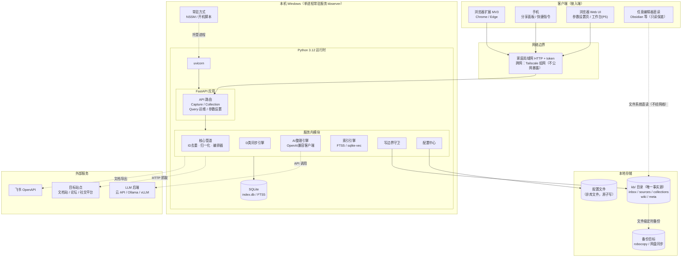

# 个人知识沉淀与 AI 工作台 · 方案文档

> 版本：v0.12（P1 实施启动：entry 枚举补 cli 通道；归一化引擎降级策略）
> 日期：2026-10-02
> 状态：架构方向与五项技术决策均已拍板（见第 9 节）；风险审查见第 8 节；角色建模见第 10 节；模块架构/职责卡/参数设置页/系统架构图/UI 方案参考见第 11 节；AI 协作规则见 `.codebuddy/rules/`（本文件为其设计事实源）

---

## 1. 需求定义

### 1.1 一句话需求

把互联网上看到的内容沉淀为个人知识库，沉淀能力归属于一个**尚未定型**的个人 AI 工作台。

### 1.2 四个关注点

```
① 采集    多平台、多入口，把内容拿进来
② 存储    统一格式落盘，成为长期数据资产
③ 整理    AI 自动加工（总结/标签/摘要卡），回流库中（依赖 ①② 的产出格式）
④ 工作台  未来形态未定的消费层（视图 + AI 交互）（消费 ①②③ 的产出）
```

### 1.3 核心结论

**④ 未定型，所以 ①②③ 必须做成与工作台无关的独立系统。**
管道的产出是"通用工具可直接读取的本地文件资产"（Markdown + frontmatter + 原始件），工作台只是后来的一个客户端。工作台选型（Obsidian、自研 Web、现成 AI 工具）不影响也不阻塞管道建设。

### 1.4 已确认的边界条件

| 决策     | 内容                                                   |
| -------- | ------------------------------------------------------ |
| 存量关系 | 全新项目，不涉及任何历史系统迁移                       |
| 采集入口 | 双入口并重：日常随手剪藏（高频）+ 专项批量抓取（低频） |
| AI 形态  | 优先自动整理（异步流水线），而非对话式问答             |
| 部署形态 | 本地为主 + 移动端可随手沉淀（需要轻量常驻服务）        |

---

## 2. 来源分类

来源不只按平台分，更要**按沉淀粒度**分——单条流与集合同步是两种一等公民。

| 类别                        | 例子                                                   | 内容特征                                         | 沉淀策略                           | 粒度               |
| --------------------------- | ------------------------------------------------------ | ------------------------------------------------ | ---------------------------------- | ------------------ |
| **A. 社交内容**       | 小红书、抖音、快手                                     | 单条、碎片、反爬强、视频为主                     | 剪藏为主，批量后置                 | 单条流             |
| **B. 社区论坛**       | 各类论坛                                               | 帖子流、按作者/关键词批量                        | 传统抓取                           | 单条流             |
| **C. 协作在线文档**   | 飞书/腾讯文档/Notion/语雀上的"我的/共享给我的"文档     | 私有、需要登录态、单篇导出                       | 官方 API 导出，按需单篇/按目录拉取 | 单条流             |
| **D. 公开产品文档站** | `docs.volcengine.com`（ByteHouse 指南）、各类 docs.* | 公开、成体系（目录树/多级导航/数百页）、持续更新 | 站点级批量抓取 + 增量同步          | **集合同步** |

### 2.1 D 类的独特性（区别于 C 类的三个要点）

1. **粒度是"站点/目录树"而非"单篇"**——沉淀一套产品文档意味着一次拿几十上百页，不可能手动剪藏。
2. **有结构层级**——产品 → 版本 → 章节 → 页面，落盘必须保留这棵树，否则知识库退化成一堆散页。
3. **活文档**——官方文档持续更新，沉淀一次即过时，需要**定期增量同步**（变更才更新，保留版本差异意识）。

### 2.2 平台策略与优先级

优先级标注与第 7 节路线图阶段一一对应（机械核查项）。

| 平台             | 路径                                                                                      | 优先级 |
| ---------------- | ----------------------------------------------------------------------------------------- | ------ |
| 任意网页         | 浏览器扩展剪藏（正文提取）。**P0 指服务端 capture+归一化链路；浏览器扩展本体在 P1** | P0/P1  |
| 飞书文档         | 官方 OpenAPI 导出，最稳，无需对抗                                                         | P2a    |
| 论坛             | 传统抓取 adapter                                                                          | P2b    |
| 产品文档站       | 可配置目录树抓取器，首个实例：火山引擎文档站                                              | P2c    |
| 小红书/抖音/快手 | 先靠剪藏沉淀；视频类批量抓取单独立项（涉及字幕 ASR，成本高）                              | 后置   |

**关键取舍**：小红书/抖音不走批量爬虫优先——反爬对抗成本高且不稳定，而"看到好内容随手存"恰好是这类内容最真实的使用场景，剪藏入口天然覆盖。

---

## 3. 总体架构

```
入口层                          管道层                     数据层
┌────────────┐                 ┌──────────────────┐
│ 浏览器扩展   │ ┐               │ inbox 暂存队列     │        ┌─────────────────┐
│ 手机分享/快捷│ ┼─ HTTP API ──▶ │   ↓ 归一化        │ ────▶ │ kb/ 本地目录      │
│ 指令        │ │   (常驻轻服务) │   ↓ AI 整理(异步)  │        │ md + raw + meta │
│ 批量爬虫    │ ┘               │   ↓ 索引          │        │ + SQLite 索引    │
└────────────┘                 └──────────────────┘        └─────────────────┘
```

### 3.1 三条设计原则（铁律）

1. **文件系统是唯一事实源。**
   SQLite/向量库只是可重建的索引缓存。这保证将来无论工作台选什么，都能直接挂载数据，系统不被任何前端绑架。
2. **入口多样性，出口唯一性。**
   剪藏、爬虫、飞书 API 各写各的 adapter，但落盘只有一种格式。新增平台 = 新增一个 adapter，管道零改动。
3. **管道分阶段、可断点、失败可观测。**
   每个条目带 `status: inbox → normalized → enriched`（外加失败态 `error`，见 4.2），任何一步中断都能续跑；失败的条目进入 `error` 态并记录失败阶段与原因，可重跑复活，不静默丢失。

### 3.2 调度模型：两种队列

- **单条流队列**（A/B/C 类）：一次一条，随到随处理，剪藏/API 导出均入此队列。
- **集合任务队列**（D 类）：一个 collection = 一个长驻同步任务（全量首抓 → 周期性 diff → 只落变更页）。

两种模式共用同一入口 API 与归一化出口，仅调度与增量逻辑不同。

> 本节为概念概览；模块级拆解、职责卡与部署视图见第 11 节。

---

## 4. 数据 Schema（v0 草案）

### 4.1 目录结构

```
kb/
├── inbox/                       # 捕获后未归一化的暂存
├── sources/                     # A/B/C 类：单条沉淀
│   └── <platform>/<年>/<条目id>/
│       ├── note.md              # 归一化正文 + frontmatter
│       ├── raw/                 # 原始件（html/截图/图片/视频元数据）
│       └── meta.json            # 程序元数据（与 frontmatter 职责分离，见 4.4）
├── collections/                 # D 类：文档站集合
│   └── <collection-id>/
│       ├── collection.json      # 站点配置 + 同步状态
│       ├── toc.json             # 目录树快照（含每页 content_hash，diff 依据）
│       └── docs/<章节路径>/
│           ├── <页面>.md
│           └── raw/
├── wiki/                        # AI 产出的摘要卡/概念卡（隔离区，schema 见 4.5）
└── index.db                     # 全文/向量索引（可重建）
```

运行时路径约束：目录字面量一律 ASCII（占位符 `<platform>`/`<章节路径>` 等在落盘时须替换为 ASCII 安全值）；Windows 下注意路径长度（见 5.3）。

### 4.2 frontmatter 核心字段（A/B/C/D 类条目通用）

```yaml
---
id: <唯一条目id>
url: <来源url>                       # 解析重定向后的 canonical URL
platform: <开放枚举，小写>            # xiaohongshu / douyin / kuaishou / forum / feishu / volcengine / tencent_doc / notion / yuque / web（兜底）；新增平台 = 注册新值
source_type: social | forum | collab_doc | product_doc   # 管道分流依据
captured_at: 2026-10-02T12:00:00+08:00
title: <标题>
status: inbox | normalized | enriched | error            # 管道阶段标记；error 态详情记 meta.json
tags: []
collection: <collection-id>                               # D 类必填，其余省略；D 类来源定位以 collection 为主、platform 为辅
ai:                                                       # 仅 enrich 阶段后存在
  summary: <摘要>
  model: <模型标识>
  generated_at: <时间>
---
```

**status 载体说明**：capture 阶段产出的是原始 payload（尚无 frontmatter），状态记在同目录 sidecar `capture.json`（`url / captured_at / status: inbox / entry: browser_ext | mobile_share | crawler | collab_api | cli`，按入口通道分类，互斥；`cli` 为 P0 命令行投递通道）；normalize 生成 `note.md` 后状态迁移到 frontmatter。**error 态**：附加 `error_stage` 与 `error_message`（记于 meta.json，见 4.4），重跑成功后清除并回到前一状态。

### 4.3 collection.json 与 toc.json

collection.json：

```json
{
  "id": "volcengine-bytehouse",
  "name": "ByteHouse 企业版文档",
  "entry_url": "https://docs.volcengine.com/docs/ByteHouseEnterpriseEdition/list?lang=zh",
  "url_pattern": "<页面 URL 匹配规则>",
  "toc_parser": "<目录树解析方式>",
  "sync": {
    "last_synced_at": "<上次同步时间>",
    "changed_pages": ["<变更页路径清单，增量同步断点依据>"]
  }
}
```

toc.json：目录树结构 + **每页 `content_hash`**（diff 依据：结构 diff 用树对比，内容 diff 用 hash）。`changed_pages` 由 diff 结果生成。**所有状态类 JSON（collection.json / toc.json / capture.json）写盘一律原子写（临时文件 + rename），防止进程中断产生半写文件。**

### 4.4 双文件职责分离与两条纪律

**meta.json 与 frontmatter 职责交集为空（防双写漂移）**：

| 文件                    | 定位                            | 独占内容                                                                                                                                                                        |
| ----------------------- | ------------------------------- | ------------------------------------------------------------------------------------------------------------------------------------------------------------------------------- |
| `note.md` frontmatter | 人机共同接口（工作台/用户读写） | 4.2 所列字段（`ai.*`、`tags` 可被更新）                                                                                                                                     |
| `meta.json`           | 程序消费，人工不改              | `content_hash`、`original_url`（短链等非规范来源）与重定向链（canonical URL 只存 frontmatter `url`，避免双写）、`error_stage`/`error_message`、raw 文件清单、抓取指纹 |

两条纪律：

1. **AI 内容强制溯源**：`wiki/` 所有卡片带 `ai_generated: true`，与原始沉淀物理隔离；仅 `status: promoted`（人工确认）的卡片可被索引与工作台图谱引用——防止自动整理污染库的准确性。
2. **写入边界白名单（字段级）**：管道各环节只允许写自己的目标区，越界直接拒绝并计数；字段级细化——
   - normalize：只写 `sources/`（或 `collections/` 下对应页）与 `inbox/` 清理；
   - enrich：对源条目**仅允许写 frontmatter 的 `ai.*` 与 `tags` 两个字段**，其余一律禁写；卡片产物只写 `wiki/`；
   - sync（D 类）：只写 `collections/<id>/` 内部。

### 4.5 wiki 卡约定

```yaml
---
id: <wiki卡id>
type: summary | concept
ai_generated: true
status: draft | promoted          # draft=AI 产出待确认；promoted=人工确认，可被索引/图谱引用
sources: [<sources条目id 或 collection页id>, ...]   # 溯源引用
created_at: <时间>
model: <生成模型>
---
```

晋升机制：人工将卡片 frontmatter 的 `status` 由 `draft` 改为 `promoted`（工作台 UI 或直接编辑均可）；无批量自动晋升通道。

---

## 5. 管道设计

### 5.1 阶段定义

| 阶段      | 输入            | 输出                                             | 写边界                 | 说明                                                         |
| --------- | --------------- | ------------------------------------------------ | ---------------------- | ------------------------------------------------------------ |
| capture   | 各入口          | `inbox/<id>/` 原始 payload + `capture.json`  | `inbox/`             | 原样保存，不做加工                                           |
| normalize | inbox           | `sources/` 或 `collections/` 条目            | 各自目标区             | 正文提取、转 Markdown、frontmatter 生成、写边界校验          |
| enrich    | normalized 条目 | `wiki/` 摘要卡 + 源条目 `ai.*`/`tags` 回写 | `wiki/` + 白名单字段 | 异步、带重试与断点；失败 → 条目转`error` 态，不阻塞主链路 |
| index     | 落盘成果        | `index.db`                                     | `index.db`           | 落盘后增量更新，定期全量重建校准；可随时删除重建             |

### 5.2 D 类集合同步流程

```
注册 collection → 全量首抓（遍历目录树）→ toc.json 快照（含每页 content_hash）
     ↑                                        ↓
     └──── 周期性 diff（目录树对比 + content_hash）←──┘
                    ↓ 仅变更页（写入 changed_pages，原子写）
              重新归一化落盘 → 更新 sync 状态
```

页面更新策略与单条流一致（见 5.3 第 4 条）：同路径 content_hash 变化 → 覆盖 `note.md`，旧版 raw 归档。

### 5.3 已知坑位（提前设防）

1. **文档站相对链接**：转 Markdown 后必须后处理站内相对 URL（统一改写为绝对 URL 或降级为纯文本），否则脱离原站后交叉引用全是断链。
2. **正文提取质量分层**：公开文档站结构规整，可做到接近无损转换（表格/代码块）；社交平台提取质量天然参差，raw 原件永远保留，便于重新提取。
3. **AI 回流审核**：自动打标签/摘要可能不准确，一律先进 `wiki/` 隔离区（draft 态）。
4. **同 URL 内容更新**：判重以规范化 URL 幂等；同 id 的 `content_hash` 变化时更新 `note.md` 并将旧 raw 归档至 `raw/<归档时间戳>/`，不覆盖历史原始件。**短链**（t.co、xhslink 等）：capture 时解析重定向，以最终 canonical URL 判重；`original_url` 记于 meta.json。
5. **图片防盗链**：社交/文档站图片多带防盗链，外链会失效——随抓取本地化至 `raw/`，`note.md` 引用本地相对路径。
6. **Windows 路径长度**：D 类深层章节路径可能超 MAX_PATH——章节路径落盘前清洗（限长、必要时编号化），或启用系统长路径支持。

---

## 6. 部署形态

- **常驻轻服务**（本地进程）：暴露 HTTP API（capture 入口、集合任务管理、状态/运维、检索——检索 P4 起提供，见第 11 节 Query/运维 API），附带最小 Web UI，其核心即**参数设置页**（§11.5）。
- **网络可达前提**：手机投递要求服务可被手机访问——P1 起监听局域网（`0.0.0.0`）+ 长期 token；明文 HTTP 仅限可信家庭局域网；跨网场景建议 Tailscale 类组网，**不建议**直接公网暴露。桌面浏览器扩展走 `127.0.0.1`，无此前提。
- **鉴权**：本地 token；暴露面扩大时升级 HTTPS。
- **移动端沉淀**：手机分享/快捷指令调用 capture API 投递 URL 或文本，服务端异步补全抓取。
- **备份**：`kb/` 目录为唯一事实源，纳入文件级备份（定时 robocopy/网盘同步均可）；`index.db` 可重建，无需备份。

---

## 7. 分期路线

| 阶段          | 内容                                                               | 交付判据                                                                     |
| ------------- | ------------------------------------------------------------------ | ---------------------------------------------------------------------------- |
| **P0**  | schema 定稿 + 轻量服务骨架（capture API + 归一化落盘）             | 命令行/HTTP 投递 URL，正确落盘为 sources 条目（含去重与 error 态路径）       |
| **P1**  | 浏览器扩展（右键存当前页）+ 手机投递入口 + 局域网监听              | 日常高频场景闭环，可真实使用                                                 |
| **P2a** | C 类 adapter：飞书 OpenAPI 文档导出                                | 单篇/按目录拉取落盘                                                          |
| **P2b** | B 类 adapter：论坛抓取                                             | 按关键词/作者批量落盘                                                        |
| **P2c** | D 类站点抓取器（目录树遍历 + 增量 diff），首个实例：火山引擎文档站 | 一个 collection 完成首抓与一次增量同步                                       |
| **P3**  | AI 整理流水线（总结/标签/摘要卡，带重试与断点）                    | 任意 normalized 条目可产出 wiki 卡并回写白名单字段                           |
| **P4**  | 全文 + 向量索引                                                    | FTS5 中文检索可用（自建样本集冒烟通过），经 Query API 暴露；向量检索作为增强 |
| **P5**  | 工作台 UI 选型与实现                                               | 此时数据管道已就绪，选型从容、随时可换                                       |

---

## 8. 风险清单

| 风险                                           | 应对                                                                                                                      |
| ---------------------------------------------- | ------------------------------------------------------------------------------------------------------------------------- |
| 小红书/抖音反爬成本高                          | 明确不做批量优先，剪藏入口覆盖；批量立项独立评估                                                                          |
| AI 回流污染库准确性                            | wiki 隔离区 +`ai_generated` 溯源 + draft/promoted 人工确认晋升                                                          |
| 文档站结构变化导致解析失效                     | toc.json 结构指纹 diff；解析器按站点可配置；解析失败页记`error` 态可见                                                  |
| 工作台选型反复                                 | 数据主权在文件系统，工作台永远可替换，风险被架构化解                                                                      |
| 服务未运行时入口投递丢失（单点）               | 入口端本地暂存 + 服务恢复后重发（扩展/快捷指令缓存队列）；capture API 幂等（同 URL 去重）保证重发安全                     |
| 本地数据丢失                                   | `kb/` 目录文件级定时备份（见第 6 节）；index.db 可重建                                                                  |
| 同 URL 内容漂移/短链判重失效                   | canonical URL + content_hash 更新策略（见 5.3 第 4 条），旧 raw 归档                                                      |
| 配置文件敏感信息泄露（api_key/token 明文落盘） | 参数设置页掩码显示、日志不打印明文（11.5 纪律）；配置文件限定本机用户可读权限；泄露影响面为外部服务凭据，可在对应平台轮换 |

---

## 9. 技术决策记录（2026-10-02 已拍板）

| # | 决策项         | 结论                                                        | 要点                                                                                                                                                                                                                                                                                                                             |
| - | -------------- | ----------------------------------------------------------- | -------------------------------------------------------------------------------------------------------------------------------------------------------------------------------------------------------------------------------------------------------------------------------------------------------------------------------- |
| 1 | 条目 id 规则   | **URL 规范化哈希**                                    | 规范化（小写 host、去`utm_*`/追踪参数、去 fragment）后取 SHA-1 前 12~16 位；同一 URL 重复捕获天然幂等去重。细则：D 类页面 id = `collection-id + 站内路径` 哈希（文档站 URL 查询参数不稳定）；无 URL 内容（随手记文本）降级为 `时间戳+短随机`；短链解析重定向后按 canonical URL 判重（见 5.3）。id 首次捕获时生成后永不改变 |
| 2 | 服务技术栈     | **Python 3.12 + FastAPI + SQLite（标准库）+ uvicorn** | 抓取/解析生态（trafilatura、Playwright、markdownify、飞书 SDK）与 AI SDK 均在 Python；SQLite 零部署与"文件系统事实源"一致；个人规模单进程异步足够，inbox 目录即队列，不引入消息队列。常驻用`python -m kbserver` 起步，Windows 下后配 NSSM/开机脚本                                                                             |
| 3 | 浏览器扩展形态 | **MV3 扩展**（Chrome/Edge 同一份 Chromium 代码）      | 功能最小化：右键菜单 + 快捷键，投递 URL + 标题 + 选中文本 + 页面截图到 capture API；权限收敛到`activeTab`。选中文本是剪藏的核心增量价值（记录"为什么收藏"）                                                                                                                                                                    |
| 4 | AI 模型接入    | **可配置多后端，统一 OpenAI 兼容协议**                | 配置`base_url + api_key + model`；Ollama/vLLM 本地模型同协议兼容，零锁定。整理任务分级调用：打标签/字段抽取用便宜快模型，摘要卡/概念卡用强模型，成本可控                                                                                                                                                                       |
| 5 | 全文索引引擎   | **SQLite FTS5 起步，向量后置（sqlite-vec 扩展）**     | 零部署、单文件、可随时重建，符合铁律 1；个人库规模（<10 万条）足够，中文分词用 simple/trigram 起步（FTS5 默认 unicode61 对中文检索无效，必须显式配置）。明确不引入 Elasticsearch/Milvus/Qdrant，P4 实测不足再升级，升级成本由"索引可重建"原则兜底                                                                                |

> 待定项已全部关闭，P0 可开工。

---

## 10. 用户角色与使用场景

本系统为单人系统：角色不是不同的人，而是**同一用户在不同场景下的使用姿态**，外加两个系统侧行为者。区分姿态的意义：每个姿态的核心工作清单即验收用例与 P0–P5 需求映射的直接来源。

### 10.1 收集者（Captor）——最高频姿态

**场景**：刷小红书/抖音看到攻略想"以后用得上"——3 秒内完成沉淀，中断成本趋近于零；电脑上读到长文/文档站某页，想连同"我为什么收藏它"（当时选中的一段话）一起存下；手机里看到好链接随手转发给服务。

**核心工作**：

1. 浏览器扩展：右键/快捷键投递（URL + 标题 + 选中文本 + 截图）——P1
2. 手机分享面板/快捷指令投递 URL 或文本——P1
3. 投递后无需等待，服务端异步补全抓取；断网/服务未运行时本地暂存自动重发
4. **不做**：不整理、不打标签、不分类——与整理监工的分工边界

### 10.2 研究者（Batch Runner）——专项低频姿态

**场景**：系统学习 ByteHouse——注册一个 collection 指向文档树，一次拿下全站并持续跟进官方更新；追踪某论坛作者全部帖子/某关键词历史帖。

**核心工作**：

1. 注册抓取任务：录入入口 URL、`url_pattern`、`toc_parser`（D 类）——P2b/P2c
2. 审查首抓质量：抽查正文转换、图片本地化、相对链接处理
3. 维护增量同步：查看 `changed_pages`、处理 error 页面与文档站改版
4. **不做**：不逐页阅读——那是消费者姿态的事

### 10.3 整理监工（Curation Supervisor）——AI 回流的把关人

**场景**：攒了一批 normalized 条目后让 AI 批量总结/打标签/生成摘要卡；因 AI 标签可能错、摘要可能幻觉，需要人工把关而非全自动。

**核心工作**：

1. 配置分级模型：打标签用便宜快模型、摘要卡用强模型——P3
2. 审阅 `wiki/` draft 卡：**晋升（draft→promoted）、打回重生成或删除**
3. 纠正 AI 标签（只改 frontmatter `tags`——写边界允许的唯一可改区）
4. 监控成本与 error 态条目，触发重跑

### 10.4 消费者（Consumer）——系统存在的最终目的

**场景**：三个月前存过的文章现在要用——搜关键词几秒找到；研究某主题时按 collection 目录树成体系阅读；写作时引用已晋升的 wiki 概念卡。

**核心工作**：

1. 全文检索（P4 起），按 `platform`/`source_type`/`collection`/`tags` 过滤
2. 按 D 类目录树浏览成体系文档；按时间流浏览单条沉淀
3. 查看溯源链（wiki 卡 → sources 条目 → 原始 raw）
4. **P5 前的过渡形态**：直接用 Obsidian/任意编辑器读 `kb/` 目录——"文件系统是事实源"给消费者的保底承诺，也是工作台定型前唯一可用的消费方式

### 10.5 运维者（Operator）——保障姿态

**场景**：重装系统/换电脑后服务与库要完整恢复；服务挂了几天，怀疑期间手机投递的内容丢失。

**核心工作**：

1. 常驻部署与升级：`python -m kbserver` → NSSM/开机脚本
2. 验证备份可恢复：`kb/` 定时备份 + 一次性恢复演练（index.db 不备份、靠重建）
3. 巡检 error 态条目与失败集合任务，重跑修复
4. token 与暴露面管理（局域网 → Tailscale 升级路径）
5. 经参数设置页维护服务参数（监听/token/模型/同步周期，见 11.5）

### 10.6 AI 整理引擎（系统侧行为者）

**场景**：被整理监工触发，批量处理 normalized 条目。

**核心工作**：生成摘要/标签/wiki 卡草稿；**只写允许的区域**（`wiki/` draft 卡 + 源条目 `ai.*`/`tags` 两个字段）；所有产物带 `ai_generated: true` 溯源；失败转 error 态而非静默跳过。

### 10.7 姿态 × 管道阶段 × 路线图对照

| 角色        | 触达阶段         | 主要落点                         |
| ----------- | ---------------- | -------------------------------- |
| 收集者      | capture          | P0（HTTP 投递）、P1（扩展/手机） |
| 研究者      | capture + sync   | P2a/P2b/P2c                      |
| 整理监工    | enrich           | P3                               |
| 消费者      | index + 全部产出 | P4，保底靠文件系统               |
| 运维者      | 全链路保障       | 贯穿，P1 起有实际运维面          |
| AI 整理引擎 | enrich           | P3 实现                          |

**关键结论**：收集者姿态是唯一"不做就会断"的——它决定沉淀的连续性；其余姿态都可滞后补做。这印证了路线图把 P0/P1（投递闭环）排在最前的合理性。

---

## 11. 核心模块架构

> 依据 §3–§5 的设计拆解。工作台按 §1.3 原则以"契约内客户端"占位，模块细节 P5 定型时展开。

### 11.1 模块清单

**入口层**（不落业务逻辑，只投递；出口唯一性由 Capture API 收敛）：

| 模块              | 职责                                                 | 落点 |
| ----------------- | ---------------------------------------------------- | ---- |
| 浏览器扩展（MV3） | 右键/快捷键投递 URL+标题+选中文本+截图；离线暂存重发 | P1   |
| 手机分享入口      | 分享面板/快捷指令投递 URL/文本                       | P1   |
| 爬虫 Adapter      | 论坛批量抓取，产出统一 capture payload               | P2b  |
| 协作文档 Client   | 飞书 OpenAPI 单篇/目录导出                           | P2a  |

> 注：爬虫/协作文档 Adapter 为服务内模块，经**进程内调用**同一 capture 处理函数（不强制 HTTP 环回），与外部入口共享同一出口语义。

**服务层**（kbserver 单进程内模块）：

| 模块                 | 职责                                                                     | 关键约束                                                                                |
| -------------------- | ------------------------------------------------------------------------ | --------------------------------------------------------------------------------------- |
| API 网关             | Capture / Collection 任务 / Query·运维 / 参数设置 四组路由；token 鉴权  | 唯一入口；Query API（检索、条目读取、状态、重跑/重建指令）P0 骨架先行、检索能力 P4 补齐 |
| inbox 队列           | capture payload 落`inbox/` + `capture.json` sidecar                  | 目录即队列，不引入 MQ；落盘经守卫                                                       |
| ID/去重引擎          | URL 规范化 → SHA-1 前 12~16 位；短链重定向解析；canonical 判重          | 幂等投递的保证                                                                          |
| 归一化引擎           | 正文提取、转 Markdown、图片本地化、相对链接后处理、frontmatter/meta 生成 | 各平台可插拔提取器，出口唯一                                                            |
| 管道编排器           | 状态机`inbox→normalized→enriched/error`；断点续跑；error 记录与重跑  | 全链路唯一流程控制点，其余模块无状态                                                    |
| D 类同步引擎         | 目录树抓取、toc.json 快照、diff（树+content_hash）、变更页处理           | 长驻任务，与单条流分队列                                                                |
| AI 整理引擎          | OpenAI 兼容多后端客户端；分级任务（标签/摘要/概念卡）；wiki 卡生成       | 只写白名单区与字段（§4.4）                                                             |
| 索引引擎             | FTS5 增量维护 + 定期重建校准；sqlite-vec 后置                            | 可随时 DROP 重建                                                                        |
| **写边界守卫** | 全部落盘的唯一通道：区域白名单 + 字段级白名单 + 原子写（tmp+rename）     | 横切模块，即 §4.4"写入边界白名单"纪律（下文简称写边界）的执行机制；任何模块不得绕过    |
| 配置中心             | 模型后端、token、站点解析器注册表；参数设置页的读写后端（§11.5）        | 平台扩展只改配置不改管道；配置文件原子写、敏感项掩码                                    |

**数据层**：`kb/` 五区（inbox / sources / collections / wiki / index.db），定义见 §4，本节不重复。

> 注：备份是**系统外手段**（定时 robocopy/网盘同步，见 §6），不设模块。

### 11.2 业务结构图（Mermaid）


### 11.3 读图要点与纪律

1. **所有写盘箭头必经"写边界守卫"**——唯一无旁路的模块（capture 落 inbox、normalize 落 sources/collections、AI 落 wiki 与回写、索引落 index.db 全部经守卫）；
2. **虚线 = 控制流/读取/回写，实线 = 数据流**；编排器驱动但不搬运数据；
3. **D 类同步引擎与单条流管道并行**，共享归一化出口、AI 整理与守卫（D 类变更页同样可进入 enrich），符合 §3.2"同一出口、不同调度"；
4. **AI 模块依赖归一化产物**（normalized 条目/变更页），不直接消费原始件；
5. **工作台三条纪律**：
   - 写操作只能走 API 通道（经守卫）；
   - 文件直读为只读保底通道——工作台最小可用形态（哪怕只是 Obsidian 打开目录）也成立；
   - **人工直接编辑 `kb/` 文件属系统外例外**（§4.5 允许），守卫无法约束，由 §6 备份策略兜底；工作台 UI 若实现编辑功能则必须走 API；
6. 工作台内部模块全部占位，P5 定型时展开；换工作台 = 只换该 subgraph，服务层零改动。

### 11.4 模块职责卡

> §11.1 清单的运行时视角。每张卡的"我不做"与"我做"同样重要——模块间零越界，才使得"换工作台、加平台、换模型"都只动一个点。每条核心工作可直译为 P0–P5 验收用例。

**Capture API（前台接待员）**——所有内容的唯一受理窗口。
场景：扩展右键、手机快捷指令、批量任务启动，所有投递先到这里报到。
做：token 鉴权；参数校验；组装统一 capture payload（URL/标题/选中文本/截图/入口标记）；交 inbox 队列；快速返回受理结果。
不做：不抓取、不判重、不转格式——受理即结束，响应必须快。

**inbox 队列（暂存区管理员）**——"先收下来再说"的缓冲带。
场景：任何 payload 受理后先落定于此，等编排器处理。
做：建 `inbox/<id>/`；写原始 payload + `capture.json` sidecar（`status: inbox`、入口通道）；经守卫原子落盘。
不做：不解析、不判断内容好坏——乱码也原样保管，交下游裁决。

**ID/去重引擎（户籍警）**——决定条目"是不是新面孔"。
场景：capture 发 id；归一化落盘前判重；D 类同步判断页面是否真变了。
做：URL 规范化 → 短链重定向解析 → SHA-1 前 12~16 位；canonical URL 幂等判重；D 类用 `collection-id + 站内路径`；同 id 比对 `content_hash` 识别内容更新。
不做：不删除重复投递记录——判重后归档，受理历史不抹。

**归一化引擎（翻译官）**——把五花八门的原始件翻译成唯一库内格式。
场景：编排器从 inbox 取件；D 类同步产出变更页。
做：按 `platform` 选提取器 → 正文提取 → 转 Markdown → 图片本地化 `raw/` → 相对链接后处理 → 生成 frontmatter/meta.json（含 `content_hash`）→ 经守卫落盘。**降级策略**：抓取失败或提取为空、且 payload 带选中文本时，降级以选中文本落盘（meta.json 记 `extraction: selection_fallback`，原文页语义不转 error）；无选中文本时维持 error 态，等动态页兜底（Playwright）或人工处理。
不做：不判断内容价值、不调 AI——只忠实转换；提取质量差保留 raw 等重提取，不擅自删改。

**管道编排器（调度台）**——全系统唯一知道"每条内容走到哪一步"的角色。
场景：服务启动恢复现场；新条目推进；重跑指令复活 error 条目。
做：维护状态机 `inbox→normalized→enriched/error`；驱动去重→归一化→触发 AI→通知索引；断点续跑；error 记录 `error_stage`/`error_message` 并保持可重试。
不做：不亲自搬运数据（只发指令）；不跳步——normalized 之前绝不让 AI 碰原始件。

**D 类同步引擎（驻外联络员）**——管"一整个文档站"的长期跟进。
场景：注册 collection 首抓；周期性醒来增量。
做：目录树抓取 → toc.json 快照（含每页 `content_hash`）→ 周期 diff → 变更页清单原子写入 `changed_pages` → 变更页交归一化并流入 AI 整理。
不做：不碰单条流；站点改版解析失败不硬猜——页面转 error 态等研究者处理。

**AI 整理引擎（实习生）**——产出草稿，但不给自己的草稿转正。
场景：存在 normalized 条目（含 D 类变更页）时被编排器唤醒批量加工。
做：分级调用 LLM（标签用便宜模型、摘要卡用强模型）→ 生成总结/标签/wiki 卡草稿 → `draft` 态写 `wiki/`（带 `ai_generated: true`）→ 回写源条目仅限 `ai.*`/`tags` 两字段 → 失败转 error。
不做：不晋升自己的卡片（promoted 仅人工）；不碰源条目其他字段；不直接消费原始件。

**索引引擎（图书馆编目员）**——让库"可被找到"，但知道自己是可牺牲的。
场景：新内容落盘增量更新；定期重建校准；P4 起支撑检索。
做：读取落盘成果 → 维护 FTS5（显式配置中文分词）→ sqlite-vec 向量增强 → 产出 `index.db`（经守卫）。
不做：不修改任何库文件——只读消费者 + 独立索引产出；index.db 坏了就重建、不备份。

**写边界守卫（门禁系统）**——不是业务模块，但所有写盘箭头必须穿过它。
场景：任何模块要写任何文件的那一刻。
做：区域白名单校验（normalize→sources/collections、AI→wiki+两字段、sync→本 collection、index→index.db）；字段级白名单；原子写（tmp+rename）；越界拒绝并计数上报。
不做：不约束系统外的人工直接编辑（§4.5 认可的例外，备份兜底）——只管系统内的手。

**Query/运维 API（问询处+指挥台）**——消费者和运维者只跟它说话，不直接摸库。
场景：工作台查询检索/条目/状态；运维者巡检 error、下发布局重跑与索引重建指令。
做：检索代理（P4）；条目与溯源链读取；状态汇总；指令下发交编排器与索引引擎执行。
不做：不做写盘裁决——写操作（如 wiki 晋升）只转交守卫，自己无权动库。

**配置中心（后勤处）**——平台扩展和换模型只改它，不改代码。
场景：服务启动加载配置；注册新站点解析器；切换 LLM 后端。
做：管理模型后端（base_url/key/model 分级）、token、解析器注册表（url_pattern/toc_parser）；向归一化/AI/同步引擎分发配置；作为参数设置页读写后端（§11.5）。
不做：不存业务数据——库里没有一条内容经过它。

**入口层四兄弟（侦察兵：扩展/手机/爬虫/飞书 Client）**——形态各异，只做一件事：把东西送到 Capture API 门口。
场景：收集者随手存（扩展/手机）；研究者专项批量（爬虫/飞书 Client）。
做：采集投递上下文；扩展侧离线暂存 + 恢复后重发；服务内 adapter 经进程内调用同一 capture 处理函数。
不做：不理解内容、不做格式转换——侦察兵不带分析室。

### 11.5 参数设置页

**定位**：常驻服务最小 Web UI 的核心页面，配置中心的人工界面。原则：**凡架构中的可配置项，一律经该页设置**，避免参数散落在多处配置文件靠手工编辑。页面读写经配置中心；配置文件不属于 `kb/` 库文件，不经过写边界守卫，但写盘同样原子写。

**参数清单**（按分区）：

| 分区         | 参数                                                                                      | 说明 / 约束                                                               |
| ------------ | ----------------------------------------------------------------------------------------- | ------------------------------------------------------------------------- |
| 服务         | 监听地址/端口、token、`kb/` 库目录路径                                                  | 库目录路径变更为危险项：二次确认 + 迁移确认，不静默切换                   |
| AI 模型      | 各任务级模型配置（标签/摘要卡/概念卡各自的 base_url、key、model）、超时、重试次数、并发度 | key 输入掩码显示，不回显明文                                              |
| D 类同步     | 默认同步周期、首抓并发数、失败重试策略                                                    | per-collection 覆盖项在`collection.json`（§4.3），本页只编辑全局默认值 |
| 归一化       | 默认提取器选择、图片本地化开关、相对链接处理策略                                          | 站点级覆盖走解析器注册表                                                  |
| 解析器注册表 | 各站点`url_pattern` / `toc_parser` 可视化编辑（新增/停用/试跑）                       | 试跑结果只读预览，确认后生效                                              |
| 索引         | 向量索引开关（P4 起）、全量重建按钮                                                       | 重建为指令下发，走 Query/运维 API                                         |

**四条纪律**：

1. **单一配置入口**：本页是配置的唯一人工界面；直接编辑配置文件仍允许（系统外例外，定位同 §11.3 人工编辑），页面读取以配置文件为准，两者不产生第二事实源；
2. **敏感项掩码**：api_key/token 输入与回显掩码，日志不打印明文；
3. **危险项二次确认**：库目录路径变更、全量重建、解析器删除需显式确认；
4. **变更生效机制**：支持热加载的项（模型配置、解析器）即时生效并提示；需重启的项（监听地址/端口）明确标注"重启后生效"；所有配置写盘原子写。

### 11.6 系统架构图（技术/部署视图）

> 与 11.2 业务结构图互补：业务图给开发看模块怎么拆，本图给部署与运维看边界与依赖。



**读图要点**：

1. **网络边界清晰**：桌面扩展走 `127.0.0.1`，手机与 Web UI 走局域网 + token，跨网只经 Tailscale——无任何公网暴露面；
2. **两类持久化分开**：`kb/` 是唯一事实源（经守卫写入），配置文件独立管理（参数设置页读写，不经守卫但原子写）；`index.db` 可重建不备份；
3. **三条外部依赖各自隔离**：站点抓取、飞书 OpenAPI、LLM 后端任一不可用只影响对应模块，不拖垮服务；
4. **Obsidian 直读箭头不经网络不经服务**——"文件系统是事实源"的兑现，工作台定型前的兜底消费路径；
5. 备份在系统外（文件级定时任务），图上是虚线依赖而非模块。

### 11.7 UI 方案参考（AI 生成示意图）

> 以下为 AI 生成的 UI 示意图（五张页面图 + 一张折叠态示意），用于评审布局与信息架构，**非最终视觉稿**；图中文字、数字均为示意，实现时以本文档 schema 与枚举为准。

**⑤ 工作台整体布局总览**（全局信息架构）


**① 参数设置页**（运维者 / §11.5）


**② 检索主页**（消费者 / §10.4）


**③ AI 审核台**（整理监工 / §4.5+§10.3）


**④ 条目详情页**（消费者 / §4.2+§4.4）


**UI 约束（评审确认项）**：

- **左侧主导航必须兼容折叠/展开两种形态**：展开态显示图标+文字，折叠态为图标窄栏（悬浮 tooltip 提示菜单名），用户选择需持久化；审核台待办角标在折叠态以红点形式保留。折叠状态属 UI 偏好，存浏览器本地即可，不进参数设置页、不进配置文件。

**折叠态导航示意**：


折叠态要素核对：图标窄栏、审核台红点角标、tooltip 提示、底部同步状态点、内容区相应加宽——均已呈现。

**待拍板偏差清单**（示意图引入的新概念，采纳需回写对应章节）：

| 偏差                   | 出处 | 待定                                                              |
| ---------------------- | ---- | ----------------------------------------------------------------- |
| 审核台"操作日志"面板   | ③   | enrich 操作流水是否落库（若采纳需新增数据定义）                   |
| AI 摘要卡"置信度 92%"  | ④   | §4.5 enrich 输出是否增加置信度字段                               |
| 审核台缺"删除"处置入口 | ③   | 10.3 三处置（晋升/打回/删除）的 UI 呈现                           |
| 状态词"已发布/已归档"  | ②   | 实现时须对齐 §4.2 status 枚举（inbox/normalized/enriched/error） |
| 参数页未画并发度字段   | ①   | §11.5 AI 模型分区参数完整性                                      |

---

## 修订记录

| 版本  | 日期       | 变更                                                                                                                                                                                                                                                                                                                                    |
| ----- | ---------- | --------------------------------------------------------------------------------------------------------------------------------------------------------------------------------------------------------------------------------------------------------------------------------------------------------------------------------------- |
| v0.1  | 2026-10-02 | 立项草案                                                                                                                                                                                                                                                                                                                                |
| v0.2  | 2026-10-02 | 第 9 节技术决策定稿                                                                                                                                                                                                                                                                                                                     |
| v0.3  | 2026-10-02 | R1 风险审查修订：§2.2/§7 优先级口径统一并补论坛阶段；status 增加 error 态与载体说明；meta.json/frontmatter 职责分离；enrich 字段级写边界；wiki 卡 schema 与晋升机制；toc.json 补 content_hash 与原子写；短链/内容更新/图片本地化/Windows 路径坑位；网络可达前提与备份策略；风险清单补单点与数据丢失项                                 |
| v0.4  | 2026-10-02 | 新增第 10 节"用户角色与使用场景"：五个用户姿态（收集者/研究者/整理监工/消费者/运维者）+ AI 整理引擎，含场景、核心工作、姿态×阶段×路线图对照                                                                                                                                                                                           |
| v0.5  | 2026-10-02 | 新增第 11 节"核心模块架构"：模块清单（入口层/服务层）+ Mermaid 业务结构图（含工作台占位块与两条契约通道）+ 读图纪律；R1 审查修复——补 Query/运维 API（检索/条目读取/指令通道）并同步 §6 与 P4 判据；修正 capture 落盘绕过守卫的链路；补 D 类变更页进入 enrich、运维指令通道、人工直接编辑系统外例外、adapter 进程内调用与备份定位注记 |
| v0.6  | 2026-10-02 | 新增 11.4 模块职责卡（12 张卡，含"我不做"边界）与 11.5 参数设置页（六分区参数清单 + 四条纪律：单一配置入口/敏感项掩码/危险项二次确认/变更生效机制）；同步更新 §6、§10.5、API 网关与配置中心职责，架构图新增参数设置页节点                                                                                                             |
| v0.7  | 2026-10-02 | 新增 11.6 系统架构图（技术/部署视图）：客户端接入端、网络边界（局域网+token/Tailscale）、kbserver 单进程部署结构、本地存储双轨（kb/ 事实源 + 配置文件）、三条外部依赖隔离与备份虚线依赖；与 11.2 业务结构图互补                                                                                                                         |
| v0.8  | 2026-10-02 | 新增 11.7 UI 方案参考：嵌入五张 AI 生成示意图（工作台整体布局/参数设置页/检索主页/AI 审核台/条目详情）并标注对应章节；新增 UI 约束——左侧主导航须兼容折叠/展开（折叠态图标窄栏+tooltip，状态持久化，审核台角标折叠态保留红点）；登记五项待拍板偏差（操作日志/置信度/删除入口/状态词对齐/并发字段）                                     |
| v0.9  | 2026-10-02 | 补充折叠态导航示意图；细化折叠状态持久化定位（UI 偏好存浏览器本地，不进参数设置页/配置文件，避免与单一配置入口纪律冲突）；全文风险复审——修正 11.7 导语图数计数，§8 补配置文件敏感信息泄露风险，§3 补"模块细化见第 11 节"指引                                                                                                        |
| v0.10 | 2026-10-02 | 新增项目级 AI 协作规则集（参考 CodeBuddy Rules 规范与业界 AGENTS.md/CLAUDE.md 实践）：`.codebuddy/rules/` 五条规则（核心铁律/技术栈/工作流为 always-apply，设计索引/UI 约束按需加载）+ 根目录 `AGENTS.md` 跨工具入口；规则只列行为约束，设计细节引用本文档防漂移                                                                    |
| v0.11 | 2026-10-02 | P0 实施启动：§4.2 capture.json 的 entry 枚举补充`cli`（命令行投递通道），对应 §7 P0 交付判据"命令行/HTTP 投递 URL"；无其他 schema 变更                                                                                                                                                                                              |
| v0.12 | 2026-10-02 | P1 验收驱动：§11.4 归一化引擎职责卡补降级策略——抓取/提取失败且 payload 带选中文本时降级以选中文本落盘（meta.json 记 `extraction: selection_fallback`），呼应 §9 决策 3"选中文本是剪藏的核心增量价值"；无选中文本仍转 error 等 Playwright 兜底。无 schema/API 变更                                                                      |
